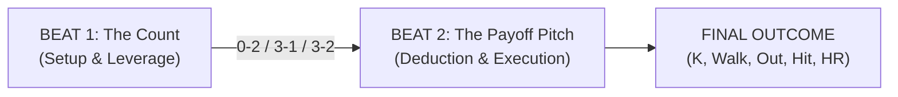

# Full Count — Developer Diary & Design Chronicle

> *"Baseball is ninety percent mental. The other half is physical."* — Yogi Berra  
> 
> This diary chronicles the design iterations, philosophical debates, technical breakthroughs, and discarded dead-ends in building **Full Count**: a tabletop-digital baseball confrontational card game.

---

## Design Philosophy

The driving ambition of *Full Count* has never been to build a spreadsheet simulation of baseball. It is to capture the visceral, high-stakes psychological chess match between a pitcher standing on the mound and a hitter digging into the batter's box.

Every pitch in baseball is a game of deduction, hand management, and execution:
- What does the count dictate?
- What is the pitcher's tendency in this spot?
- Does the batter sit on high heat or stay back for the breaking ball?
- Can you read the opponent's intent, and when you do, can you execute?

Here is how *Full Count* evolved from a cluttered 3-zone math puzzle into a clean, tense, deduction-first card duel.

---

## Entry 1: The First Pitch — The 3-Zone Prototype & Multiplayer Foundation
**Date**: September 30, 2026  
**Commits**: `dd6a5e4` → `9cb12ee`

### The Problem
We started with a blank canvas and a core question: *How do you simulate a plate appearance using cards without turning it into a 20-minute board game?*

Our earliest design took inspiration from modern card battlers. We created three distinct zones to resolve an at-bat:
1. **Zone 1 (The Pitch / Approach)**: Contest of intent and eye.
2. **Zone 2 (The Contact / Velocity)**: Contest of bat speed vs. fastball life.
3. **Zone 3 (The Batted Ball / Field)**: Contest of trajectory and defense.

We built this as a real-time 2-player web application backed by Firebase Realtime Database with 6-letter room codes, customizable rosters (starting pitchers, relievers, lineup batting orders), and 70 action cards loaded with counters, affinities, and modifiers.

### What Didn't Feel Right
In practice, the game suffered from severe cognitive overload:
- Players were asked to distribute up to 4 cards across 3 zones *simultaneously*.
- Cards had walls of rules text: cross-zone penalties, counter-conditions, and stamina modifiers.
- The UI was overflowing on screens; players spent more time reading small text on cards than looking at the scoreboard or thinking about what pitch was coming.
- It felt like an accounting spreadsheet rather than standing at home plate.

### The Fix
We immediately established strict layout boundaries, flex-box anchoring for mobile viewports, and began hunting for a cleaner model.

---

## Entry 2: Going Solo — The Practice Bot & Headless Test Suite
**Date**: October 4, 2026  
**Commits**: `6437f56` → `34e49bf`

### The Problem
Iterating on a 2-player multiplayer game is painfully slow if every test requires opening two browser windows, creating a room, copying a code, and playing against yourself. Furthermore, game balance was impossible to gauge without thousands of at-bats.

### Options Explored
1. *Local Hotseat*: Two players pass the phone. (Awkward, doesn't solve solo testing).
2. *Random Bot*: Bot plays completely random cards. (Fails to test real game scenarios or tactical edge cases).
3. *Autonomous Practice Bot with Repertoire Awareness*: A bot that plays role-specific cards, conserves pitching charges, and hunts scouting weaknesses.

### The Decision
We built the **Practice Bot 🤖** and integrated a 1-click **Solo Practice Match** directly on the lobby screen.
Simultaneously, we engineered a headless Chrome testing infrastructure:
- `run-tests.ps1`: Automated browser runner verifying card data, character attributes, zone math, and UI rendering.
- `run-sim.ps1`: A 10-game headless simulation harness executing ~300 plate appearances in under 5 seconds to generate statistical box scores, ERA, and batting averages.

This test harness became our safety net: from this point forward, every single rules tweak could be verified against a 10-game simulation in seconds.

---

## Entry 3: Breaking the Mold — From Simultaneous Dump to Sequential Beats
**Date**: October 4–5, 2026  
**Commits**: `8c5d6ac` → `79356f5`

### The Problem
Even with the Practice Bot, the core game loop had a fundamental pacing flaw: **the simultaneous card dump**. Both players placed all their cards across all zones at once, pressed "Lock In," and watched a barrage of numbers resolve.

In real baseball, a plate appearance is never resolved in one simultaneous burst. It unfolds in sequential beats:
1. The windup and the pitch establish the count.
2. The batter reacts, decides whether to commit, and starts the swing.
3. The collision determines the flight of the ball.

### Options Explored
- **Option A: The Gauge & Bell-Curve System**. We experimented with a numerical strike zone gauge where players tried to hit target sums (e.g., target 13, wild bust over 20) with inverse bell-curve distributions.
  - *Why it was discarded*: It felt artificial and mathematical. Real pitchers don't think about "tuning a dial to 13"; they think about throwing 98 mph up and in or dropping a curveball below the knees.
- **Option B: Sequential Multi-Beat Resolution**. Break the plate appearance into sequential chapters, where the outcome of the first phase changes the conditions of the second phase.

### The Decision
We discarded the gauge meters and committed to sequential phases:
- Tracked pitch repertoires with charges (Fastball: 4, Breaking: 3, Offspeed: 2).
- Introduced initiative: the loser of an early beat reveals their card first in the next beat, giving the leader tactical vision.

---

## Entry 4: The Crucible — The 2-Beat Engine & Hand Economy
**Date**: October 6, 2026 (Morning)  
**Commits**: `b36c98f` → `20cd06c`

### The Problem
Three beats still had too much filler. Beat 3 (resolving the batted ball) felt like rolling dice or re-adjudicating what Beat 2 had already decided. If a batter crushes a 95 mph fastball right down the middle, the outcome should belong to that collision, not an arbitrary post-contact phase.

Furthermore, hand sizes had ballooned to 6–8 cards, causing choice paralysis.

### The Solution: The 2-Beat Engine
We distilled the entire confrontation down to baseball's two sacred dramatic moments:



1. **Beat 1: The Count**
   - A single-card clash that decides leverage:
     - Pitcher wins $\rightarrow$ **0-2 Pitcher's Count** (Batter on defense).
     - Batter wins $\rightarrow$ **3-1 Hitter's Count** (Pitcher in danger).
     - Tie $\rightarrow$ **3-2 Full Count** (Even showdown).
2. **Beat 2: The Payoff Pitch**
   - The pitcher selects Pitch Type & Pitch Location.
   - The batter selects Swing Type & Anticipated Zone.
   - Both play a card to execute.
3. **The 5-Card Hand Economy**
   - Each PA starts with exactly 5 cards.
   - Players play exactly **1 card in Beat 1** and **1 card in Beat 2**.
   - After the PA, both players draw back up to 5.
   - Every single card gained enormous tactical significance: do you spend your best card to win the count in Beat 1, or save it to execute the payoff pitch in Beat 2?

We also introduced the **Public Scouting Report** for every batter (Hot Zone, Cold Zone, Favorite Pitch) so pitching strategy felt grounded in real tactical scouting.

---

## Entry 5: Stripping Away the Noise — Pure Number Cards & The Anticipation Factor
**Date**: October 6, 2026 (Midday)  
**Commits**: `c2c0e18` → `ed98a5b`

### The Problem
Even with the 2-Beat structure, cards still had legacy text, conditional triggers, and ability paragraphs. Players had to squint at their screens and read complex logic mid-turn.

Additionally, the moment of resolution felt abrupt. When both players locked in, the result instantly appeared with no buildup, robbing the game of the breath-holding tension that makes baseball thrilling.

### The Solution: Pure Numbers (1–10)
We stripped all 70 action cards down to **Pure Number Cards (Values 1–10)**.
- No ability text. No modifiers. No conditional triggers.
- Just clean, beautiful, bold numbers with crisp tactile styling.
- All game rules moved from card text into the core system mechanics.

### The Solution: Anticipation & Tiered Count Leverage
To bring the drama to life:
1. **The In-Between Beats Result Modal**: An animated suspense banner recapping who won Beat 1 and the established count (`0-2`, `3-1`, or `3-2`).
2. **Tiered Count Leverage**:
   - **Simple Win (Margin 1–3)**: Imposes an **Option Lockout** on the opponent:
     - `0-2 Count`: Batter's **Power Swing** is locked out (forced into survival contact).
     - `3-1 Count`: Pitcher's **Offspeed Pitch** is locked out (forced to challenge with heat or break).
   - **Dominant Win (Margin $\ge 4$)**: Imposes Option Lockout PLUS **Forced Face-Up Reveal**! The loser must commit and expose their card face-up first; the winner counters with open eyes.

---

## Entry 6: The Deduction Heart — Aligning Outcomes with Deduction
**Date**: October 6, 2026 (Afternoon)  
**Commit**: `dec138a`

### The Problem
During playtesting, a critical design dissonance emerged. The user pointed out:
> *"The outcome of the ab doesn't feel right. Let's think through it some more. Because it's a game of deduction, the primary driver of the result should be the location and pitch type match. If the batter guessed correctly and executed a good swing, then ultimately the result should be in their favor. But if they guessed incorrectly, even if they executed a good swing, it should favor the pitcher."*

Under the prior system, if a batter guessed completely wrong (looked high fastball, pitcher threw low curve), but played a higher raw number card, they could still get a ringing hit. That betrayed the core promise of the game: **deduction must matter more than raw number supremacy**.

### The Solution: The Deduction Hierarchy
We codified three strict Match Tiers:
- **Full Match**: Batter correctly read **both** Pitch Type and Location. The batter holds supreme advantage; good card execution yields extra-base hits or home runs.
- **Partial Match**: Batter read **one** of the two (e.g., timed the fastball, but missed the location). Duel is contested; card execution decides whether pitcher or batter wins.
- **Whiff**: Batter guessed **neither** pitch nor location. The batter was completely fooled. Even if the batter played a powerful card, the result is capped at weak flyouts or popouts, heavily favoring the pitcher.

---

## Entry 7: The Grand Unification — Overlapping Ranges and the Timing Delta
**Date**: October 6, 2026 (Evening)  
**Commit**: `f04f6d2`

### The Problem: The "Mistimed" Trap & The "High Card Always Wins" Trap
As we refined Beat 2, the user identified a deep logical contradiction:
> *"What does a result of mistimed mean? Why would a player ever play a swing and card combination where the card is less than the difficulty? This same logic applies to the pitcher choice. How can we address that too?"*

In the previous system, pitches and swings had flat execution difficulties (e.g., Fastball required $\ge 3$, Power required $\ge 8$).
- If a player had a card lower than 8, playing Power was an objectively terrible self-sabotaging mistake ("mistimed").
- If we simply made "highest card wins," the game degenerated into always hoarding and playing 10s. Low cards (1, 2) became useless garbage in the hand.

The user then proposed a revolutionary concept:
> *"Here's another idea, what if the number range associated with a pitch are not exclusive. So an offspeed is 1-5, a breaking ball is 3-7, etc. What does that unlock? So is the outcome determined by the delta between the cards then?"*

### The Architectural Breakthrough: Overlapping Ranges + Timing Delta ($\Delta$)

```
PITCHES:
Offspeed (Touch & Deception):    [ 1 ─── 2 ─── 3 ─── 4 ─── 5 ]
Breaking (Bite & Spin):                  [ 3 ─── 4 ─── 5 ─── 6 ─── 7 ]
Fastball (Velocity & Heat):                              [ 6 ─── 7 ─── 8 ─── 9 ─── 10 ]

SWINGS:
Contact (Choke Up / Wait Back):  [ 1 ─── 2 ─── 3 ─── 4 ─── 5 ]
Balanced (Controlled Timing):            [ 3 ─── 4 ─── 5 ─── 6 ─── 7 ]
Power (Turn on the Ball):                                [ 6 ─── 7 ─── 8 ─── 9 ─── 10 ]
```

#### Why Overlapping Ranges Work
1. **Every Number Has a Vital Purpose**: Low cards (1, 2) are no longer junk—they are elite weapons to throw unhittable changeups or choke up on defense.
2. **Pitch Tunneling**: Cards 3–5 can be either an Offspeed pitch or a Breaking ball. Cards 6–7 can be either a Breaking ball or a Fastball. Even when a dominant Beat 1 forces a pitcher to reveal a card face-up (e.g. Card 4), the batter still does not know if it is an offspeed fading away or a breaking ball snapping down!

#### The Timing Delta Formula
The collision is governed by the timing difference between pitcher and batter:
$$\Delta = | \text{Pitcher Card} - \text{Batter Card} |$$

| Timing Delta | Quality | Description | Collision Effect |
| :---: | :---: | :---: | :--- |
| **$\Delta = 0$** | **Squared Up** 🎯 | Sweet Spot Barrel | Punishes mistake pitches; transforms full deduction into crushed Home Runs. |
| **$\Delta \le 2$** | **Solid Timing** 🏏 | Clean Contact | Sharp line drives, gap doubles, or flyouts depending on location read. |
| **$\Delta \le 4$** | **Off-Balance** 🧤 | Weak Contact | Choked-up defensive singles, routine grounders, or infield popouts. |
| **$\Delta \ge 5$** | **Mistimed Whiff** ⚡ | Way Off | Swinging strikeout on nasty stuff unless protected by a defensive contact swing. |

### The Genius of Timing Delta
If a pitcher throws a dirty 2 Offspeed changeup and the batter swings out of their shoes with a 10 Power card:
$$\Delta = |2 - 10| = 8$$
The batter is caught way out in front—**an ugly swinging strikeout**!
Playing the highest card no longer guarantees a win. You must match the timing of the pitch you are hunting.

---

## Current Status & Verification Baseline
As of Commit `f04f6d2`:
- **Automated Tests**: 121 browser-automated unit tests pass with zero failures (`tests/test_resolution.html`, `tests/test_play_ui.html`).
- **Game Simulation**: 10-game automated simulation (`run-sim.ps1`) confirms realistic baseball metrics: 3.50 runs/game, extra-inning drama, and a 50/50 balance between home and away.
- **Repository State**: Clean working tree on `main` branch.

---

## Living Changelog Protocol
> **From this point forward**, every code modification, rules tweak, or balance adjustment will conclude with an appended entry in this diary documenting:
> 1. The specific problem being addressed.
> 2. The options explored and trade-offs weighed.
> 3. The decision and technical implementation.
> 4. Verification test results and simulation impact.

---

## Entry 8: Streamlining the Duel — Removing Location to Focus on Pitch & Timing

### The Problem: Cognitive Overload & Decision Fatigue in Beat 2
Following the implementation of overlapping timing ranges, the game gained immense strategic depth. A card of value 4 was no longer just "4 points"—it was the snap of a sweeping slider or the fading tumble of a changeup.

However, this mechanical depth immediately exposed an interface and cognitive flaw. The user observed:
> *"The pitch selection needs to be simpler now that we've implemented the overlapping pitches. I want to pick a pitch type and a number card. Choosing location is too much."*

In the previous design, resolving Beat 2 required an overwhelming number of concurrent decisions:
- **Pitcher**: Pick Pitch Type (`fastball`, `breaking`, `offspeed`) + Pick Location (`high`, `low`) + Pick Number Card (1–10). *(3 selections)*
- **Batter**: Anticipate Pitch (`fastball`, `breaking`, `offspeed`) + Anticipate Location (`high`, `low`) + Choose Swing Approach (`contact`, `balanced`, `power`) + Pick Number Card (1–10). *(4 selections)*

For the batter, making four distinct choices on every single payoff pitch was exhausting. It diluted the psychological focus of the duel. Instead of asking the quintessential baseball question—*"Is he bringing the heater or dropping the curveball, and can I time it?"*—the player was bogged down in a 50/50 high/low coin toss that felt like mechanical clutter.

### Options Explored

1. **Option 1: Retain Location as a Passive Modifier or Trait Bonus**
   - *Concept*: Keep high/low location as an optional guess that provides a minor +1 timing forgiveness if guessed correctly.
   - *Why Rejected*: It would preserve the visual clutter and UI buttons without adding compelling gameplay. It would fail to solve the user's direct directive: *"Choosing location is too much."*

2. **Option 2: Tie Pitch Types to Fixed Zones**
   - *Concept*: Dictate that fastballs are always high and breaking balls are always low.
   - *Why Rejected*: Artificial and rigid. It eliminates agency without making the decision-making cleaner, and turns scouting reports into predictable scripts.

3. **Option 3 (Chosen): Eliminate Location Completely — Focus on Pitch Deduction & Timing Delta**
   - *Pitcher selects*: **Pitch Type** + **Number Card**.
   - *Batter selects*: **Anticipated Pitch** + **Swing Approach** + **Number Card**.
   - *Why it succeeds*:
     - **Purity of Deduction**: The batter either correctly reads the pitch type (`matched`) or is fooled (`whiff`).
     - **Intuitive Execution**: The pitch type dictates the required timing window (Offspeed [1–5], Breaking [3–7], Fastball [6–10]).
     - **Snappy UI**: The interface drops an entire section of tiles from both sides. The player can look at the count, pick their pitch/swing, tap a card, and lock in within seconds.

### Technical Implementation

1. **Resolution Engine (`js/resolution.js`)**:
   - Stripped `pitchLocation` and `targetZone` from `resolveBeat2`.
   - Deduction simplified to a crisp binary check:
     $$\text{pitchMatched} = (\text{effectiveGuessPitch} === \text{pitchType})$$
   - Resolution matrix streamlined:
     - **Pitch Anticipated**:
       - $\Delta = 0$ (Squared Up): Crushed Home Run on Power swing, gap double on Balanced, clean single on Contact.
       - $\Delta \le 2$ (Solid Timing): Wall-ball doubles, clean singles, or home runs if hunting the batter's favorite pitch (`scoutingReport.favoritePitch`).
       - $\Delta \le 4$ (Off-Balance): Protected by the correct pitch read; contact swings find holes for singles, power swings fly out to the warning track.
       - $\Delta \ge 5$ (Mistimed): Even with the pitch read, massive timing error leads to strikeouts on power swings.
     - **Fooled on Pitch (`whiff`)**:
       - Pitcher heavily favored!
       - $\Delta \le 2$: Weak contact only (popouts and routine grounders); barrel HRs are impossible when fooled.
       - $\Delta \ge 3$: Swinging strikeouts dominate unless the batter choked up on a defensive Contact swing.
   - Preserved `locationMatched: pitchMatched` and `sameLocation: pitchMatched` in return objects for backward compatibility.
   - Updated `resolveSequentialPA` and `executeBotPlayBeat` to remove all zone/location logic.

2. **User Interface (`js/app.js`)**:
   - Removed Section 2 Location selection tiles from `renderPitcherPayoffDeck` and `renderBatterPayoffDeck`.
   - Updated the Action Lock button subtext to display dynamic timing range validation (`✓ In Timing Range [min–max]` vs `⚠ Out of Range`).
   - Cleaned up the public scouting bar: replaced obsolete Hot/Cold zone chips with the Batter's Archetype style and their Favorite Pitch (`⭐ HUNTS: [PITCH]`), plus pitcher pitch timing brackets (`[6–10]`, `[3–7]`, `[1–5]`).
   - Streamlined the outcome overlay to display clear deduction badges: `🎯 PITCH ANTICIPATED` vs `❌ FOOLED ON PITCH`.

3. **Test Suites & Verification**:
   - Updated Section 13 of `tests/test_resolution.html` to validate all timing delta outcomes without location parameters.
   - Updated `tests/sim_games.html` and headless test runners.

### Verification Results
- **Automated Unit Tests**: 120 of 120 browser tests pass (`run-tests.ps1`).
- **Game Simulation**: 10-game simulation (`run-sim.ps1`) completed 260 PAs with realistic baseball totals (5.70 runs/game, 94 total hits, 5 home wins, 5 away wins).
- **Player Experience**: Beat 2 now feels electric, focused, and fast-paced. Pitcher and batter engage in an uncluttered mind game of pitch selection and timing execution.
