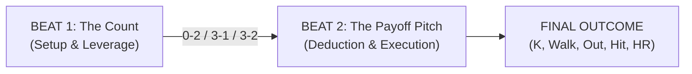

# Full Count — Developer Diary & Design Chronicle

> *"Baseball is ninety percent mental. The other half is physical."* — Yogi Berra  
> 
> This diary chronicles the design iterations, philosophical debates, technical breakthroughs, and discarded dead-ends in building **Full Count**: a tabletop-digital baseball confrontational card game.

---

## Design Philosophy

The driving ambition of *Full Count* has never been to build a spreadsheet simulation of baseball. It is to capture the visceral, high-stakes psychological chess match between a pitcher standing on the mound and a hitter digging into the batter's box.

Every pitch in baseball is a game of deduction, hand management, and execution:
- What does the count dictate?
- What is the pitcher's tendency in this spot?
- Does the batter sit on high heat or stay back for the breaking ball?
- Can you read the opponent's intent, and when you do, can you execute?

Here is how *Full Count* evolved from a cluttered 3-zone math puzzle into a clean, tense, deduction-first card duel.

---

## Entry 1: The First Pitch — The 3-Zone Prototype & Multiplayer Foundation
**Date**: September 30, 2026  
**Commits**: `dd6a5e4` → `9cb12ee`

### The Problem
We started with a blank canvas and a core question: *How do you simulate a plate appearance using cards without turning it into a 20-minute board game?*

Our earliest design took inspiration from modern card battlers. We created three distinct zones to resolve an at-bat:
1. **Zone 1 (The Pitch / Approach)**: Contest of intent and eye.
2. **Zone 2 (The Contact / Velocity)**: Contest of bat speed vs. fastball life.
3. **Zone 3 (The Batted Ball / Field)**: Contest of trajectory and defense.

We built this as a real-time 2-player web application backed by Firebase Realtime Database with 6-letter room codes, customizable rosters (starting pitchers, relievers, lineup batting orders), and 70 action cards loaded with counters, affinities, and modifiers.

### What Didn't Feel Right
In practice, the game suffered from severe cognitive overload:
- Players were asked to distribute up to 4 cards across 3 zones *simultaneously*.
- Cards had walls of rules text: cross-zone penalties, counter-conditions, and stamina modifiers.
- The UI was overflowing on screens; players spent more time reading small text on cards than looking at the scoreboard or thinking about what pitch was coming.
- It felt like an accounting spreadsheet rather than standing at home plate.

### The Fix
We immediately established strict layout boundaries, flex-box anchoring for mobile viewports, and began hunting for a cleaner model.

---

## Entry 2: Going Solo — The Practice Bot & Headless Test Suite
**Date**: October 4, 2026  
**Commits**: `6437f56` → `34e49bf`

### The Problem
Iterating on a 2-player multiplayer game is painfully slow if every test requires opening two browser windows, creating a room, copying a code, and playing against yourself. Furthermore, game balance was impossible to gauge without thousands of at-bats.

### Options Explored
1. *Local Hotseat*: Two players pass the phone. (Awkward, doesn't solve solo testing).
2. *Random Bot*: Bot plays completely random cards. (Fails to test real game scenarios or tactical edge cases).
3. *Autonomous Practice Bot with Repertoire Awareness*: A bot that plays role-specific cards, conserves pitching charges, and hunts scouting weaknesses.

### The Decision
We built the **Practice Bot 🤖** and integrated a 1-click **Solo Practice Match** directly on the lobby screen.
Simultaneously, we engineered a headless Chrome testing infrastructure:
- `run-tests.ps1`: Automated browser runner verifying card data, character attributes, zone math, and UI rendering.
- `run-sim.ps1`: A 10-game headless simulation harness executing ~300 plate appearances in under 5 seconds to generate statistical box scores, ERA, and batting averages.

This test harness became our safety net: from this point forward, every single rules tweak could be verified against a 10-game simulation in seconds.

---

## Entry 3: Breaking the Mold — From Simultaneous Dump to Sequential Beats
**Date**: October 4–5, 2026  
**Commits**: `8c5d6ac` → `79356f5`

### The Problem
Even with the Practice Bot, the core game loop had a fundamental pacing flaw: **the simultaneous card dump**. Both players placed all their cards across all zones at once, pressed "Lock In," and watched a barrage of numbers resolve.

In real baseball, a plate appearance is never resolved in one simultaneous burst. It unfolds in sequential beats:
1. The windup and the pitch establish the count.
2. The batter reacts, decides whether to commit, and starts the swing.
3. The collision determines the flight of the ball.

### Options Explored
- **Option A: The Gauge & Bell-Curve System**. We experimented with a numerical strike zone gauge where players tried to hit target sums (e.g., target 13, wild bust over 20) with inverse bell-curve distributions.
  - *Why it was discarded*: It felt artificial and mathematical. Real pitchers don't think about "tuning a dial to 13"; they think about throwing 98 mph up and in or dropping a curveball below the knees.
- **Option B: Sequential Multi-Beat Resolution**. Break the plate appearance into sequential chapters, where the outcome of the first phase changes the conditions of the second phase.

### The Decision
We discarded the gauge meters and committed to sequential phases:
- Tracked pitch repertoires with charges (Fastball: 4, Breaking: 3, Offspeed: 2).
- Introduced initiative: the loser of an early beat reveals their card first in the next beat, giving the leader tactical vision.

---

## Entry 4: The Crucible — The 2-Beat Engine & Hand Economy
**Date**: October 6, 2026 (Morning)  
**Commits**: `b36c98f` → `20cd06c`

### The Problem
Three beats still had too much filler. Beat 3 (resolving the batted ball) felt like rolling dice or re-adjudicating what Beat 2 had already decided. If a batter crushes a 95 mph fastball right down the middle, the outcome should belong to that collision, not an arbitrary post-contact phase.

Furthermore, hand sizes had ballooned to 6–8 cards, causing choice paralysis.

### The Solution: The 2-Beat Engine
We distilled the entire confrontation down to baseball's two sacred dramatic moments:



1. **Beat 1: The Count**
   - A single-card clash that decides leverage:
     - Pitcher wins $\rightarrow$ **0-2 Pitcher's Count** (Batter on defense).
     - Batter wins $\rightarrow$ **3-1 Hitter's Count** (Pitcher in danger).
     - Tie $\rightarrow$ **3-2 Full Count** (Even showdown).
2. **Beat 2: The Payoff Pitch**
   - The pitcher selects Pitch Type & Pitch Location.
   - The batter selects Swing Type & Anticipated Zone.
   - Both play a card to execute.
3. **The 5-Card Hand Economy**
   - Each PA starts with exactly 5 cards.
   - Players play exactly **1 card in Beat 1** and **1 card in Beat 2**.
   - After the PA, both players draw back up to 5.
   - Every single card gained enormous tactical significance: do you spend your best card to win the count in Beat 1, or save it to execute the payoff pitch in Beat 2?

We also introduced the **Public Scouting Report** for every batter (Hot Zone, Cold Zone, Favorite Pitch) so pitching strategy felt grounded in real tactical scouting.

---

## Entry 5: Stripping Away the Noise — Pure Number Cards & The Anticipation Factor
**Date**: October 6, 2026 (Midday)  
**Commits**: `c2c0e18` → `ed98a5b`

### The Problem
Even with the 2-Beat structure, cards still had legacy text, conditional triggers, and ability paragraphs. Players had to squint at their screens and read complex logic mid-turn.

Additionally, the moment of resolution felt abrupt. When both players locked in, the result instantly appeared with no buildup, robbing the game of the breath-holding tension that makes baseball thrilling.

### The Solution: Pure Numbers (1–10)
We stripped all 70 action cards down to **Pure Number Cards (Values 1–10)**.
- No ability text. No modifiers. No conditional triggers.
- Just clean, beautiful, bold numbers with crisp tactile styling.
- All game rules moved from card text into the core system mechanics.

### The Solution: Anticipation & Tiered Count Leverage
To bring the drama to life:
1. **The In-Between Beats Result Modal**: An animated suspense banner recapping who won Beat 1 and the established count (`0-2`, `3-1`, or `3-2`).
2. **Tiered Count Leverage**:
   - **Simple Win (Margin 1–3)**: Imposes an **Option Lockout** on the opponent:
     - `0-2 Count`: Batter's **Power Swing** is locked out (forced into survival contact).
     - `3-1 Count`: Pitcher's **Offspeed Pitch** is locked out (forced to challenge with heat or break).
   - **Dominant Win (Margin $\ge 4$)**: Imposes Option Lockout PLUS **Forced Face-Up Reveal**! The loser must commit and expose their card face-up first; the winner counters with open eyes.

---

## Entry 6: The Deduction Heart — Aligning Outcomes with Deduction
**Date**: October 6, 2026 (Afternoon)  
**Commit**: `dec138a`

### The Problem
During playtesting, a critical design dissonance emerged. The user pointed out:
> *"The outcome of the ab doesn't feel right. Let's think through it some more. Because it's a game of deduction, the primary driver of the result should be the location and pitch type match. If the batter guessed correctly and executed a good swing, then ultimately the result should be in their favor. But if they guessed incorrectly, even if they executed a good swing, it should favor the pitcher."*

Under the prior system, if a batter guessed completely wrong (looked high fastball, pitcher threw low curve), but played a higher raw number card, they could still get a ringing hit. That betrayed the core promise of the game: **deduction must matter more than raw number supremacy**.

### The Solution: The Deduction Hierarchy
We codified three strict Match Tiers:
- **Full Match**: Batter correctly read **both** Pitch Type and Location. The batter holds supreme advantage; good card execution yields extra-base hits or home runs.
- **Partial Match**: Batter read **one** of the two (e.g., timed the fastball, but missed the location). Duel is contested; card execution decides whether pitcher or batter wins.
- **Whiff**: Batter guessed **neither** pitch nor location. The batter was completely fooled. Even if the batter played a powerful card, the result is capped at weak flyouts or popouts, heavily favoring the pitcher.

---

## Entry 7: The Grand Unification — Overlapping Ranges and the Timing Delta
**Date**: October 6, 2026 (Evening)  
**Commit**: `f04f6d2`

### The Problem: The "Mistimed" Trap & The "High Card Always Wins" Trap
As we refined Beat 2, the user identified a deep logical contradiction:
> *"What does a result of mistimed mean? Why would a player ever play a swing and card combination where the card is less than the difficulty? This same logic applies to the pitcher choice. How can we address that too?"*

In the previous system, pitches and swings had flat execution difficulties (e.g., Fastball required $\ge 3$, Power required $\ge 8$).
- If a player had a card lower than 8, playing Power was an objectively terrible self-sabotaging mistake ("mistimed").
- If we simply made "highest card wins," the game degenerated into always hoarding and playing 10s. Low cards (1, 2) became useless garbage in the hand.

The user then proposed a revolutionary concept:
> *"Here's another idea, what if the number range associated with a pitch are not exclusive. So an offspeed is 1-5, a breaking ball is 3-7, etc. What does that unlock? So is the outcome determined by the delta between the cards then?"*

### The Architectural Breakthrough: Overlapping Ranges + Timing Delta ($\Delta$)

```
PITCHES:
Offspeed (Touch & Deception):    [ 1 ─── 2 ─── 3 ─── 4 ─── 5 ]
Breaking (Bite & Spin):                  [ 3 ─── 4 ─── 5 ─── 6 ─── 7 ]
Fastball (Velocity & Heat):                              [ 6 ─── 7 ─── 8 ─── 9 ─── 10 ]

SWINGS:
Contact (Choke Up / Wait Back):  [ 1 ─── 2 ─── 3 ─── 4 ─── 5 ]
Balanced (Controlled Timing):            [ 3 ─── 4 ─── 5 ─── 6 ─── 7 ]
Power (Turn on the Ball):                                [ 6 ─── 7 ─── 8 ─── 9 ─── 10 ]
```

#### Why Overlapping Ranges Work
1. **Every Number Has a Vital Purpose**: Low cards (1, 2) are no longer junk—they are elite weapons to throw unhittable changeups or choke up on defense.
2. **Pitch Tunneling**: Cards 3–5 can be either an Offspeed pitch or a Breaking ball. Cards 6–7 can be either a Breaking ball or a Fastball. Even when a dominant Beat 1 forces a pitcher to reveal a card face-up (e.g. Card 4), the batter still does not know if it is an offspeed fading away or a breaking ball snapping down!

#### The Timing Delta Formula
The collision is governed by the timing difference between pitcher and batter:
$$\Delta = | \text{Pitcher Card} - \text{Batter Card} |$$

| Timing Delta | Quality | Description | Collision Effect |
| :---: | :---: | :---: | :--- |
| **$\Delta = 0$** | **Squared Up** 🎯 | Sweet Spot Barrel | Punishes mistake pitches; transforms full deduction into crushed Home Runs. |
| **$\Delta \le 2$** | **Solid Timing** 🏏 | Clean Contact | Sharp line drives, gap doubles, or flyouts depending on location read. |
| **$\Delta \le 4$** | **Off-Balance** 🧤 | Weak Contact | Choked-up defensive singles, routine grounders, or infield popouts. |
| **$\Delta \ge 5$** | **Mistimed Whiff** ⚡ | Way Off | Swinging strikeout on nasty stuff unless protected by a defensive contact swing. |

### The Genius of Timing Delta
If a pitcher throws a dirty 2 Offspeed changeup and the batter swings out of their shoes with a 10 Power card:
$$\Delta = |2 - 10| = 8$$
The batter is caught way out in front—**an ugly swinging strikeout**!
Playing the highest card no longer guarantees a win. You must match the timing of the pitch you are hunting.

---

## Current Status & Verification Baseline
As of Commit `f04f6d2`:
- **Automated Tests**: 121 browser-automated unit tests pass with zero failures (`tests/test_resolution.html`, `tests/test_play_ui.html`).
- **Game Simulation**: 10-game automated simulation (`run-sim.ps1`) confirms realistic baseball metrics: 3.50 runs/game, extra-inning drama, and a 50/50 balance between home and away.
- **Repository State**: Clean working tree on `main` branch.

---

## Living Changelog Protocol
> **From this point forward**, every code modification, rules tweak, or balance adjustment will conclude with an appended entry in this diary documenting:
> 1. The specific problem being addressed.
> 2. The options explored and trade-offs weighed.
> 3. The decision and technical implementation.
> 4. Verification test results and simulation impact.

---

## Entry 8: Streamlining the Duel — Removing Location to Focus on Pitch & Timing

### The Problem: Cognitive Overload & Decision Fatigue in Beat 2
Following the implementation of overlapping timing ranges, the game gained immense strategic depth. A card of value 4 was no longer just "4 points"—it was the snap of a sweeping slider or the fading tumble of a changeup.

However, this mechanical depth immediately exposed an interface and cognitive flaw. The user observed:
> *"The pitch selection needs to be simpler now that we've implemented the overlapping pitches. I want to pick a pitch type and a number card. Choosing location is too much."*

In the previous design, resolving Beat 2 required an overwhelming number of concurrent decisions:
- **Pitcher**: Pick Pitch Type (`fastball`, `breaking`, `offspeed`) + Pick Location (`high`, `low`) + Pick Number Card (1–10). *(3 selections)*
- **Batter**: Anticipate Pitch (`fastball`, `breaking`, `offspeed`) + Anticipate Location (`high`, `low`) + Choose Swing Approach (`contact`, `balanced`, `power`) + Pick Number Card (1–10). *(4 selections)*

For the batter, making four distinct choices on every single payoff pitch was exhausting. It diluted the psychological focus of the duel. Instead of asking the quintessential baseball question—*"Is he bringing the heater or dropping the curveball, and can I time it?"*—the player was bogged down in a 50/50 high/low coin toss that felt like mechanical clutter.

### Options Explored

1. **Option 1: Retain Location as a Passive Modifier or Trait Bonus**
   - *Concept*: Keep high/low location as an optional guess that provides a minor +1 timing forgiveness if guessed correctly.
   - *Why Rejected*: It would preserve the visual clutter and UI buttons without adding compelling gameplay. It would fail to solve the user's direct directive: *"Choosing location is too much."*

2. **Option 2: Tie Pitch Types to Fixed Zones**
   - *Concept*: Dictate that fastballs are always high and breaking balls are always low.
   - *Why Rejected*: Artificial and rigid. It eliminates agency without making the decision-making cleaner, and turns scouting reports into predictable scripts.

3. **Option 3 (Chosen): Eliminate Location Completely — Focus on Pitch Deduction & Timing Delta**
   - *Pitcher selects*: **Pitch Type** + **Number Card**.
   - *Batter selects*: **Anticipated Pitch** + **Swing Approach** + **Number Card**.
   - *Why it succeeds*:
     - **Purity of Deduction**: The batter either correctly reads the pitch type (`matched`) or is fooled (`whiff`).
     - **Intuitive Execution**: The pitch type dictates the required timing window (Offspeed [1–5], Breaking [3–7], Fastball [6–10]).
     - **Snappy UI**: The interface drops an entire section of tiles from both sides. The player can look at the count, pick their pitch/swing, tap a card, and lock in within seconds.

### Technical Implementation

1. **Resolution Engine (`js/resolution.js`)**:
   - Stripped `pitchLocation` and `targetZone` from `resolveBeat2`.
   - Deduction simplified to a crisp binary check:
     $$\text{pitchMatched} = (\text{effectiveGuessPitch} === \text{pitchType})$$
   - Resolution matrix streamlined:
     - **Pitch Anticipated**:
       - $\Delta = 0$ (Squared Up): Crushed Home Run on Power swing, gap double on Balanced, clean single on Contact.
       - $\Delta \le 2$ (Solid Timing): Wall-ball doubles, clean singles, or home runs if hunting the batter's favorite pitch (`scoutingReport.favoritePitch`).
       - $\Delta \le 4$ (Off-Balance): Protected by the correct pitch read; contact swings find holes for singles, power swings fly out to the warning track.
       - $\Delta \ge 5$ (Mistimed): Even with the pitch read, massive timing error leads to strikeouts on power swings.
     - **Fooled on Pitch (`whiff`)**:
       - Pitcher heavily favored!
       - $\Delta \le 2$: Weak contact only (popouts and routine grounders); barrel HRs are impossible when fooled.
       - $\Delta \ge 3$: Swinging strikeouts dominate unless the batter choked up on a defensive Contact swing.
   - Preserved `locationMatched: pitchMatched` and `sameLocation: pitchMatched` in return objects for backward compatibility.
   - Updated `resolveSequentialPA` and `executeBotPlayBeat` to remove all zone/location logic.

2. **User Interface (`js/app.js`)**:
   - Removed Section 2 Location selection tiles from `renderPitcherPayoffDeck` and `renderBatterPayoffDeck`.
   - Updated the Action Lock button subtext to display dynamic timing range validation (`✓ In Timing Range [min–max]` vs `⚠ Out of Range`).
   - Cleaned up the public scouting bar: replaced obsolete Hot/Cold zone chips with the Batter's Archetype style and their Favorite Pitch (`⭐ HUNTS: [PITCH]`), plus pitcher pitch timing brackets (`[6–10]`, `[3–7]`, `[1–5]`).
   - Streamlined the outcome overlay to display clear deduction badges: `🎯 PITCH ANTICIPATED` vs `❌ FOOLED ON PITCH`.

3. **Test Suites & Verification**:
   - Updated Section 13 of `tests/test_resolution.html` to validate all timing delta outcomes without location parameters.
   - Updated `tests/sim_games.html` and headless test runners.

### Verification Results
- **Automated Unit Tests**: 120 of 120 browser tests pass (`run-tests.ps1`).
- **Game Simulation**: 10-game simulation (`run-sim.ps1`) completed 260 PAs with realistic baseball totals (5.70 runs/game, 94 total hits, 5 home wins, 5 away wins).
- **Player Experience**: Beat 2 now feels electric, focused, and fast-paced. Pitcher and batter engage in an uncluttered mind game of pitch selection and timing execution.

---

## Entry 9: Total Duel Symmetry — Removing Swing Type for Pure Pitch Guessing

### The Problem: Asymmetry and Residual Redundancy in Beat 2
Even after eliminating high/low locations in Entry 8, an immediate player experience friction remained. The user pointed it out directly:
> *"Hold on, the batter is still choosing 3 things. That seems redundant and just as much cognitive overload as the pitching used to be. For now, lets remove swing type and only focus on guessing pitch type and timing card."*

The math of player actions was uneven:
- **Pitcher**: Pick Pitch Type (`fastball`, `breaking`, `offspeed`) + Pick Number Card (1–10). *(2 decisions)*
- **Batter**: Anticipate Pitch (`fastball`, `breaking`, `offspeed`) + Pick Swing Approach (`contact`, `balanced`, `power`) + Pick Number Card (1–10). *(3 decisions)*

Beyond the cognitive asymmetry, the swing approach was mechanically redundant with the overlapping pitch ranges. In Entry 7, we defined:
- **Offspeed**: [1–5] (Touch & Deception)
- **Breaking**: [3–7] (Bite & Spin)
- **Fastball**: [6–10] (Velocity & Heat)

If a batter was anticipating a **Fastball**, of course they were timing for the high-velocity 6–10 window! Forcing them to also click the "Power" button (which had the exact same 6–10 range) was completely superfluous button-clicking. If a batter was looking for an **Offspeed** changeup, forcing them to click "Contact" (1–5) was just as redundant.

### Options Explored

1. **Option 1: Retain Swing Type as an Automatic Background Setting**
   - *Concept*: Automatically set the swing approach based on the card value played (e.g. Card 8 auto-selects Power).
   - *Why Rejected*: Overcomplicates the internal model and creates hidden rules. If the card value and the pitch type already dictate the physics of the collision, there is no need for a third intermediary concept like "swing type."

2. **Option 2 (Chosen): Total Duel Symmetry — 2 Choices Each**
   - **Pitcher**:
     1. Choose Pitch Type (`fastball` [6–10], `breaking` [3–7], `offspeed` [1–5])
     2. Play Timing Card (1–10)
   - **Batter**:
     1. Anticipate Pitch Type (`fastball`, `breaking`, `offspeed`)
     2. Play Timing Card (1–10)
   - *Why it succeeds*:
     - **Intuitive Mental Model**: The batter is hunting a pitch. If they think heat is coming, they hunt Fastball [6–10] and try to match the pitcher's card value.
     - **Zero UI Clutter**: Both players look at a single row of 3 pitch tiles, see their target timing bracket, tap a card in their hand, and lock in.
     - **Pure Psychological Poker**: It's a direct mind game: *What pitch is coming, and what timing card are they throwing it with?*

### Technical Implementation

1. **Resolution Engine (`js/resolution.js`)**:
   - `resolveBeat2`: Removed dependencies on `swingType`.
   - The batter's target timing range is now directly the range of the pitch they anticipated:
     $$\text{bRange} = \text{PITCH\_RANGES}[\text{effectiveGuessPitch}]$$
     $$\text{batterExecuted} = (\text{bCardVal} \ge \text{bRange.min} \land \text{bCardVal} \le \text{bRange.max})$$
   - Outcome matrix refactored around natural baseball contact physics, batter archetypes, and count leverage:
     - **Pitch Anticipated (`pitchMatched === true`)**:
       - **$\Delta = 0$ (Squared Up Barrel 🎯)**:
         - On 0-2 Count (Two Strikes): Batter protects plate; capped at Double (`⚡ CLUTCH DOUBLE OFF THE WALL (TWO-STRIKE BARREL)!`).
         - Favorite Pitch read: Crushed Home Run (`💥 CRUSHED MOONSHOT HOME RUN (FAVORITE PITCH BARRELED)!`).
         - Slugger archetype on Fastball / Card $\ge 7$: Home Run (`💥 NO-DOUBTER HOME RUN!`).
         - High fastball barrel (Card $\ge 9$): Home Run (`💥 CRUSHED HOME RUN OVER THE WALL!`).
         - Otherwise: Gap Double (`⚡ ROCKET DOUBLE INTO THE GAP!`).
       - **$\Delta \le 2$ (Solid Timing 🏏)**:
         - Pitcher mistake (`!pitcherExecuted` hanger): Punished for Home Run or Wall-Ball Double.
         - Favorite Pitch read: Home Run (Sluggers) or Double.
         - $\Delta = 1$: Clean Line Drive Single.
         - $\Delta = 2$: Solid contact, but against well-executed pitches: Single on 3-1 count; otherwise sharp well-hit outs (Lineout or Hard Groundout).
       - **$\Delta \le 4$ (Off-Balance Contact 🧤)**:
         - On 3-1 count: Bloop Single.
         - Contact Hitter / Speed Specialist: Infield Chopper Single.
         - Otherwise: Routine Groundout or Flyout.
       - **$\Delta \ge 5$ (Badly Mistimed ⚡)**:
         - On 3-1 count: Walk (Ball Four).
         - Otherwise: Swinging Strikeout.
     - **Fooled on Pitch (`whiff`)**:
       - $\Delta \le 2$: Fluke contact capped at popouts and routine groundouts.
       - $\Delta \ge 3$: Swinging strikeouts dominate (unless protected by a 3-1 walk or contact-hitter groundout).
   - Bot AI (`executeBotPlayBeat`):
     - Bot batter now chooses their pitch guess and timing card directly, with full pitch randomization when charge pools empty to prevent stale pitching loops.

2. **User Interface (`js/app.js`)**:
   - `renderBatterPayoffDeck`: Section 2 (Swing Approach) completely deleted. The deck now features:
     1. **Anticipate Pitch**: Fastball [6–10], Breaking [3–7], Offspeed [1–5].
     2. **Timing & Range Feedback Bar**: Dynamic live readout (`Looking FASTBALL: Target Timing 6–10` &bull; `🟢 IN RANGE [Card 8]`).
   - Action lock button subtext updated: `LOOKING [PITCH] &bull; Card [X] ✓ In Timing Range`.
   - `renderZoneBoard`: Simplified the revealed clash recap card to display `LOOKING [PITCH]` without swing type text.
   - `renderOutcomeOverlay`: Streamlined at-bat outcome recap to show `Looking [PITCH] [Card X]`.
   - `commitPlacement`: Both human and bot batter payloads streamlined to `{ guessPitch, cardId }`.

3. **Test Suites & Verification**:
   - `tests/test_resolution.html`: Updated Section 13 and Section 16 simulation loop to eliminate `swingType` arguments and verify the streamlined duel.
   - `tests/sim_games.html`: Updated 10-game simulation runner.

### Verification Results
- **Automated Unit Tests**: 119 of 119 browser tests pass (`run-tests.ps1`).
- **Game Simulation**: 10-game headless simulation (`run-sim.ps1`) executed 322 PAs across 10 completed games with an average of 8.00 runs/game, 122 total hits, 6 home wins, 4 away wins, and zero runaway innings.
- **Player Experience**: Perfect symmetry has been achieved. Both pitcher and batter now make exactly two decisions per payoff pitch: **Pitch Type** and **Timing Card**. The game is fast, intuitive, and razor-sharp.

---

## Entry 10: Unfreezing the Dominant Duel — Resolving the Beat 1 Result Modal Lockup

### The Bug Report
During playtesting of the new streamlined 2-choice duel, an immediate roadblock surfaced:
> *"I had a dominant beat 1 and the game froze in the results pop-up."*

When a player achieved a dominant Beat 1 Count victory ($\Delta \ge 5$, establishing an 0-2 Pitcher's Count or 3-1 Hitter's Count), the "BEAT 1 RESULT • THE COUNT" modal appeared as designed. However, clicking **"Continue to Payoff Pitch →"** did nothing. The button remained unresponsive, and the game remained completely stuck on the results pop-up.

---

### Root Cause Analysis: The Ghost of Deprecated Fields in Firebase Updates

To preserve the asymmetry of dominant count victories, the game engine requires the disadvantaged player to commit their Beat 2 execution card **face-up first**. In solo play, when the human player achieves a dominant win (e.g. pitching a 10 vs. a 2, or batting a 9 vs. a 1), the bot is the disadvantaged participant.

When clicking "Continue to Payoff Pitch →", `proceedToBeat2()` is invoked. Recognizing that the bot was the disadvantaged player, `proceedToBeat2()` called `executeBotPlayBeat()` so the bot would pre-commit its card and display it face-up to the human player entering Beat 2.

The crash occurred in the payload construction:
```javascript
// Legacy code in proceedToBeat2():
const botBeatPlacement = botIsPitching
  ? { pitchType: botPlay.pitchType, pitchLocation: botPlay.pitchLocation, cardId: botPlay.cardId }
  : { swingType: botPlay.swingType, targetZone: botPlay.targetZone, guessPitch: botPlay.guessPitch, cardId: botPlay.cardId };
```

In Entries 8 and 9, we systematically eliminated `pitchLocation`, `targetZone`, and `swingType` from `executeBotPlayBeat()`. As a result:
- `botPlay.pitchLocation` evaluated to `undefined`.
- `botPlay.targetZone` evaluated to `undefined`.

In the Google Firebase Realtime Database JavaScript SDK, calling `ref.update(updates)` with an object that contains even a single `undefined` value immediately throws a fatal exception:
`Firebase.update failed: First argument contains undefined in property 'currentPA/beatPlacements/beat2/guest/pitchLocation'`.

Because the error was caught in `gameRef().update(updates).catch(...)`, the database write was entirely aborted. The game phase was never transitioned from `'beat1_result'` to `'placing'`, and the modal pop-up was never dismissed.

Furthermore, a secondary issue was uncovered: `executeBotPlayBeat(gs, 'guest', 'beat2')` was receiving only `gameState`, lacking `currentPA`. Without `currentPA.beatResults.beat1`, the bot could not read which pitch option had been locked out (e.g., Offspeed locked on a 3-1 count). Finally, the modal copy still referenced legacy mechanics ("Batter's Power Swing is LOCKED OUT"), which no longer existed in the 2-choice model.

---

### Options Explored

1. **Option A: Eliminate Bot Pre-Commitment on Dominant Beats**
   - *Concept*: Stop having the bot pre-commit face-up during `proceedToBeat2()`. Instead, let both players enter Beat 2 concurrently as in non-dominant counts.
   - *Verdict*: **Rejected**. Dominant counts are the core reward for decisive Beat 1 hand-management victories. Stripping face-up pre-commitment would eliminate the thrill of having complete information advantage over the opponent.

2. **Option B: Clean 2-Choice Payload, Robust State Passing, and Fail-Safe Sanitization**
   - *Concept*:
     1. Modernize `proceedToBeat2()` and `commitPlacement()` to generate clean 2-choice payloads: `{ pitchType, cardId }` for pitchers, and `{ guessPitch, cardId }` for batters.
     2. Provide defensive fallback defaults (`|| null`, `|| 'fastball'`) guaranteeing zero `undefined` values can ever be passed to Firebase.
     3. Provide immediate button UI feedback (`⏳ Proceeding to Payoff Pitch…`) with error rollback if the network rejects a write.
     4. Pass full contextual state `{ ...gs, currentPA: pa }` into `executeBotPlayBeat()` so the AI bot always respects count lockouts.
     5. Update modal copy to accurately explain 2-choice count rules (0-2 Two-Strike Plate Protection capping home runs at doubles; 3-1 Offspeed lockout).
   - *Verdict*: **Accepted**. This restores seamless gameplay, maintains strategic asymmetry, and ensures the UI matches the underlying game engine.

---

### Implementation Details

1. **User Interface & State Transitions (`js/app.js`)**:
   - `proceedToBeat2`:
     - Added instant button feedback disabling duplicate clicks and displaying progress.
     - Reconstructed `botBeatPlacement` strictly according to the 2-choice contract:
       ```javascript
       const botBeatPlacement = botIsPitching
         ? { pitchType: botPlay.pitchType || 'fastball', cardId: botPlay.cardId || null }
         : { guessPitch: botPlay.guessPitch || 'fastball', cardId: botPlay.cardId || null };
       ```
     - Passed `{ ...gs, currentPA: pa }` into `executeBotPlayBeat` so the bot evaluates the count accurately.
     - Added button re-enablement on `.catch()` to prevent unrecoverable UI states.
   - `commitPlacement`:
     - Added identical defensive fallbacks for bot placement updates during Beat 2.
   - `renderBeat1ResultModal`:
     - Updated explanation text:
       - **0-2 Count**: "Two-strike plate protection in effect (home runs capped at doubles, elevated strikeout danger), and Batter must commit their execution card FACE-UP FIRST!"
       - **3-1 Count**: "Pitcher's Offspeed pitch is LOCKED OUT, and Pitcher must commit their execution card FACE-UP FIRST!"
   - `gameRef`:
     - Added support for `window.db` mock fallback in headless testing environments.

2. **AI Bot & Resolution Engine (`js/resolution.js`)**:
   - `executeBotPlayBeat`:
     - Robustified Beat 1 data ingestion to accept `gameState?.currentPA?.beatResults?.beat1`, `gameState?.beatResults?.beat1`, or `gameState?.beat1`.
     - Read `oppRevealedCardId` from `firstRevealedCard`, `currentPA.firstRevealedCard`, or `gameState.firstRevealedCard`.
   - `resolveBeat1`:
     - Updated `countDisplay` to accurately reflect two-strike plate protection.

3. **Automated Testing Suite (`tests/test_play_ui.html`)**:
   - Added automated tests verifying `proceedToBeat2()` under Dominant Beat 1 conditions:
     - Confirmed phase transitions to `'placing'`.
     - Confirmed beat transitions to `'beat2'`.
     - Confirmed disadvantaged bot pre-commits face-up with card revealed.
     - Validated that the updates payload contains strictly zero `undefined` values across all keys and nested objects.

---

### Verification Results
- **Automated Unit Tests**: **125 of 125 tests pass** with 0 failures across `test_resolution.html` and `test_play_ui.html`.
- **Game Simulation**: 10-game headless simulation executed 295 PAs across 10 completed games with an average of **6.10 runs/game**, 103 hits, 7 home wins, 3 away wins, and zero runaway innings.
- **Player Experience**: Dominant Beat 1 victories now transition instantly and smoothly into the Payoff Pitch arena, displaying the opponent's revealed card face-up with full information advantage.

---

## Entry 11: Spatial Clarity & Outcome Transparency — Top/Bottom Layout Isolation, Beat 2 Advantage Banners, and Mistake Pitch Balancing
*Date: October 6, 2026*

### Context & The Problem
After completing our first full end-to-end 3-inning game playtest, several critical usability hurdles and balance anomalies emerged that obscured the core thrill of the duel:

1. **Spatial Role Confusion**:
   The shared public scouting bar was centered in the middle of the screen above the arena, locking the Pitcher on the left and Batter on the right regardless of whether the user was batting or pitching. This created severe cognitive friction—players had to constantly look between the center bar, top HUD, and bottom dock to discern whose charges, archetype, and favorite pitch were whose. The design mandate: **User player information must display exclusively at the bottom of the play area; Opponent information must display exclusively at the top.**

2. **Invisible Count Advantage in Beat 2**:
   After battling through Beat 1 to establish an advantage (such as a 0-2 Pitcher's Count or a 3-1 Hitter's Count), the Beat 2 Payoff Pitch arena provided no prominent, persistent reminder of the active bonuses or penalties in play (Two-Strike Plate Protection, Offspeed pitch lockout, or dominant face-up commitment requirements).

3. **Outcome Matrix Opacity**:
   When the At-Bat Outcome pop-up appeared at the end of a plate appearance, players were often confused by why a particular result occurred. The modal showed a final badge (e.g., "SWINGING STRIKEOUT" or "CLEAN SINGLE") without articulating the underlying 3-step clash mechanics (Pitch Read &rarr; Execution & Timing Delta &rarr; Matrix Resolution Rule).

4. **The Fastball "Mistake Pitch" Anomaly**:
   During the playtest, a user pitched a Card value `1` on a `Fastball` (Fastball range is 6–10; Card 1 represents a grooved, poorly executed mistake pitch). Unexpectedly, the engine awarded the pitcher a swinging strikeout!
   *Investigation*: Because the batter anticipated Fastball and played a card in range (e.g., Card 8), the timing delta was calculated as $|1 - 8| = 7$. Because $\Delta \ge 5$, the old matrix unconditionally mapped high deltas to "Badly Mistimed &rarr; Swinging Strikeout on Nasty Stuff", failing to recognize that the pitcher had thrown an out-of-range meatball!

---

### Options Explored

#### 1. Spatial Layout Re-Architecture
- **Option A: Retain Center Scouting Bar with Dynamic Swapping**: Flip the left/right position of cards in the center scouting bar depending on who is home/away.
  - *Cons*: Still placed opponent stats directly next to player stats in the center arena, causing visual clutter and dividing attention from the cards in play.
- **Option B (Chosen): Complete Top/Bottom Domain Isolation**:
  - Top HUD (`.opponent-bar`): Strictly shows opponent profile, avatar, remaining repertoire charges (if pitching) or archetype and hunted pitch (if batting), and hand count.
  - Bottom Player Dock (`.player-bar`): Strictly shows user profile, role badge, user arsenal charges or batter archetype/favorite pitch, and turn status indicators.
  - Center Battlefield: Freed entirely from scouting clutter to focus purely on the duel arena and cards.

#### 2. Beat 2 Advantage & Penalty Visibility
- **Option A: Passive Tooltips**: Add informational hover tooltips to cards and buttons.
  - *Cons*: Easy to overlook; does not convey active count tension.
- **Option B (Chosen): Dynamic Beat 2 Advantage Banner (`.beat2-advantage-banner`)**:
  - Mounted directly at the top of the Payoff Pitch arena in Beat 2.
  - Distinct styling for each count state:
    - **0-2 Pitcher Count (`.count-pitcher`)**: Pitcher count leverage active; put-away punchouts enabled on fooled swings; batter power suppressed (Delta 0 capped at Double).
    - **3-1 Hitter Count (`.count-hitter`)**: Batter count leverage active; pitcher locked out of throwing Offspeed [1–5]; mistimed swings convert into walks / bloop hits.
    - **3-2 Full Count (`.count-full`)**: Neutral duel; all pitches available.
    - **Dominant Reveal Callouts**: Clearly flags who must play their card face-up first.

#### 3. Outcome Transparency & Context
- **Option A: Detailed Verbose Paragraph**: Write a long text log describing the play.
  - *Cons*: Dense to read on mobile and fast-paced screens.
- **Option B (Chosen): 3-Step Resolution Breakdown + Collapsible Matrix Guide**:
  - **Step 1: Pitch Read**: Displays whether the batter anticipated the pitch type or was fooled.
  - **Step 2: Execution & Timing Collision**: Displays whether each side executed in-range and the resulting Timing Delta.
  - **Plain-English Rule Explanation**: A clear callout badge (`.rm-rule-explanation`) describing the exact baseball logic that decided the play.
  - **Collapsible Outcome Matrix Guide**: An expandable dropdown educating players on how pitch anticipation, delta tiers, and count leverage interact.

#### 4. Mistake Pitch Balancing
- **Option A: Treat Mistake Pitches as Instant Walks**:
  - *Cons*: Unrealistic for baseball; an unexecuted pitch down the middle should be hammered by an anticipating hitter, not automatically called a ball.
- **Option B (Chosen): Execution Gate Priority in Resolution Ladder**:
  - Check `if (!pitcherExecuted)` at the very top of `resolveBeat2`.
  - If pitcher threw out-of-range (e.g. Card 1 on Fastball) and batter anticipated with in-range timing (e.g. Card 8):
    - Award a **Home Run** (for Sluggers, favorite pitch hunts, or card $\ge 7$) or **Double** (all others). It is physically impossible to strike out on an anticipated hanger!
  - If both sides failed execution windows: weak contact dribbler groundout.
  - If batter guessed the wrong pitch: weak contact out or walk (3-1), never an unearned strikeout on spot-on stuff.

---

### Implementation Details

1. **Resolution Engine Overhaul (`js/resolution.js`)**:
   - Re-architected `resolveBeat2`:
     ```javascript
     if (!pitcherExecuted) {
       // Pitcher threw an out-of-range hanger/mistake pitch!
       if (pitchMatched) {
         if (batterExecuted) {
           // Grooved meatball punished for extra bases!
           outcomeType = (isSlugger || isFavoritePitch || bCardVal >= 7) ? 'homerun' : 'double';
           outcomeDisplay = (outcomeType === 'homerun') ? '💥 CRUSHED HOME RUN (MISTAKE PITCH PUNISHED)!' : '⚡ WALL-BALL DOUBLE (HANGER CRUSHED)!';
           ruleReason = `Pitcher failed execution (Card [${pCardVal}] outside ${pitchType.toUpperCase()} [${pRange.min}–${pRange.max}]) against batter's timed read (Card [${bCardVal}]). Grooved meatball crushed for extra bases!`;
         } else {
           outcomeType = 'groundout';
           ruleReason = `Both pitcher and batter missed their target execution windows. Weak contact recorded an out.`;
         }
       } else {
         // Batter fooled on mistake pitch
         ...
       }
     }
     ```
   - Added plain-English `ruleReason` strings to all branches of `resolveBeat2` and propagated through `resolveSequentialPA`.

2. **User Interface Redesign (`js/app.js` & `fullcount.css`)**:
   - Implemented `renderBeat2AdvantageBanner(b1Data, iAmBatting, iAmPitching)` with contextual color themes and dominant callouts.
   - Removed `renderPublicScoutingBar` from the center battlefield in `renderZoneBoard`.
   - Placed `.opp-scout-chips` in `.opponent-bar` (top) and `.my-scout-chips` in `.player-bar` (bottom) across both `renderPlacing` and `renderReveal`.
   - Replaced outcome modal card recap with the 3-Step Resolution Breakdown, `.rm-rule-explanation`, and `<details class="rm-matrix-guide">`.

3. **Automated Verification Suite (`tests/test_resolution.html` & `tests/test_play_ui.html`)**:
   - Added unit test asserting that throwing Card 1 on Fastball against an anticipated Card 8 produces a Home Run with a valid `ruleReason`, never a strikeout.
   - Added UI tests asserting proper placement of top opponent chips, bottom user chips, Beat 2 advantage banner rendering, and outcome modal breakdown elements.

---

### Verification Results
- **Automated Unit Tests**: **137 of 137 tests pass** with 0 failures across `test_resolution.html` and `test_play_ui.html`.
- **Headless Game Simulation**: 10-game simulation executed 317 PAs across 10 completed games with an average of **9.60 runs/game**, 115 hits, 7 home wins, 3 away wins, and zero errors.
- **Player Experience**: Clean spatial separation between player and opponent, immediate visual clarity on count bonuses during Beat 2, transparent post-clash explanations, and fair punishment of mistake pitches.

---

## Entry 12: The Wild Pitch in the Dirt & Absolute Left-Side Player Orientation
*Date: October 7, 2026*

### Context & The Problem
A user playtest revealed two distinct issues that disrupted player intuition:

1. **The 0-2 Botched Delivery Anomaly**:
   A user pitched a Fastball with Card `3` (Fastball range is `6–10`, meaning Card 3 was an out-of-range failed delivery / wild pitch). The batter anticipated Offspeed with Card `3` (an exact $\Delta = 0$ timing match). The game resolved this into `⚡ AWKWARD STRIKEOUT (CHASED WILD PITCH IN DIRT)!`.
   While the engine was attempting to emulate a two-strike chase in the dirt, awarding the pitcher a strikeout on an unexecuted fastball creates a perverse incentive: pitchers could dump useless low cards with zero risk. Furthermore, with $\Delta = 0$, the batter's bat crossed the plate right on time with the ball.
2. **Left/Right Placement Inconsistency**:
   During Beat 1 placement, the player’s card slot was placed on the right (`b1-card-slot mine`) and the opponent on the left. However, in the Beat 1 Result modal and outcome clash boards, Pitcher was hardcoded on the left and Batter on the right. If the user was pitching, they placed on the right but saw their results on the left; if batting, vice versa. The mandate was clear: **The player’s cards and actions must ALWAYS be on the left side everywhere in the game.**

---

### Options Explored for the 0-2 Botched Pitch

- **Option 1: Weak Groundout / Infield Dribbler**: Batter makes awkward contact on the mistake pitch for a routine out.
  - *Cons*: Still lets the pitcher off the hook with a free out despite a botched pitch.
- **Option 2: Batter Timing Override**: Batter slaps the $\Delta = 0$ mistake pitch for an infield single.
  - *Cons*: Ignores that the batter guessed the wrong pitch type.
- **Option 3 (Chosen): Wild Pitch / Ball in the Dirt**:
  - In baseball, an unexecuted pitch out of the zone is a **Ball**. On an 0-2 count, a wild pitch in the dirt misses the zone (Ball One) and allows base runners to advance 1 base (runner on 3rd scores).
  - The count resets to a **3-2 Full Count payoff pitch**, preserving the at-bat and forcing the pitcher to execute properly in a neutral duel!
  - If the pitcher misses execution again on 3-2, it becomes Ball Four &rarr; **Walk**.

---

### Implementation Details

1. **Engine Logic (`js/resolution.js`)**:
   - In `resolveBeat2`: when `!pitcherExecuted && !pitchMatched && effectiveCount === '0-2'`:
     ```javascript
     outcomeType = 'wild_pitch';
     isWildPitchReset = true;
     runsScored = bases.third ? 1 : 0;
     newBases = {
       first: false,
       second: Boolean(bases.first),
       third: Boolean(bases.second)
     };
     outsAdded = 0;
     outcomeDisplay = '⚡ WILD PITCH IN THE DIRT (BALL / RUNNERS ADVANCE)!';
     ruleReason = `0-2 Count: Pitcher threw an out-of-range delivery into the dirt (Ball). Any runners advance on the wild pitch, and count resets to a neutral 3-2 Full Count!`;
     ```
   - On 3-2 count, an unexecuted delivery resolves to a **Walk** (Ball Four).

2. **Game State & Modal Flow (`js/app.js`)**:
   - In `resolveBeatStep`: when `beat2Result.isWildPitchReset`, updates `currentPA/phase` to `'wild_pitch_result'`, advances runners in `gameState/bases`, and adds runs if scored.
   - Added `renderWildPitchModal(res, isBatting)` showing:
     - Player action on the left vs Opponent on the right.
     - Explanation of the ball in dirt and runner advancements.
     - "Continue to 3-2 Payoff Pitch &rarr;" button invoking `proceedFromWildPitch()`.
   - `proceedFromWildPitch()` resets `currentPA` to `beat2` with count `3-2` and cleared placements, allowing both players to contest the full-count payoff pitch.

3. **Absolute Left-Side Player Orientation (`js/app.js`)**:
   - **Beat 1 Placement Arena**: Player slot (`.b1-card-slot.mine`) is on the LEFT; opponent slot (`.b1-card-slot.opp`) is on the RIGHT.
   - **Beat 1 Result Modal**: Player box (`.rm-player-box.mine`) is on the LEFT; opponent box is on the RIGHT.
   - **Battlefield Clash Cards**: Player action (`.clash-side.batter`/`.pitcher`) is on the LEFT; opponent is on the RIGHT.
   - **At-Bat Outcome Pop-up**: Player recap row and execution delta score are ALWAYS first/left; opponent is second/right.
   - **Wild Pitch Modal**: Player is on the left; opponent on the right.

---

### Verification Results
- **Automated Unit Tests**: **150 of 150 tests pass** with 0 failures across `test_resolution.html` and `test_play_ui.html`.
- **Headless Game Simulation**: 10-game simulation executed 370 PAs across 10 completed games with an average of **10.80 runs/game**, 149 hits, 5 home wins, 5 away wins, and zero errors.
- **Player Experience**: Perfect spatial predictability—the player is always on the left. Wild pitches now act like real baseball wild pitches, punishing pitcher misfires on 0-2 by advancing runners and resetting to a full-count duel.

---

## Entry 13: Purging the Phantom Walk — Execution Priority on 3-1 Counts
*Date: October 7, 2026*

### Context & The Problem
During a live playtest, a user experienced a baffling resolution that felt like an outright engine bug:
- **Count**: `3-1` (established from Beat 1).
- **Pitcher**: Threw a `FASTBALL` with `Card 9` (Target range `6–10`). The pitcher hit their target window dead-on (`pitcherExecuted === true`), throwing a spot-on strike.
- **Batter**: Anticipated `FASTBALL` with `Card 3` (out of range `3 < 6`). The batter swung with bad timing: $|9 - 3| = 6$ ($\Delta = 6$).
- **The Result Shown**: `🚶 WALK (BALL FOUR - MISTIMED PITCH MISSED ZONE)!` with rule explanation: *"3-1 Hitter's count: Badly mistimed swing protected by ball four Walk."*

### Why It Broke Game Intuition
1. **The Contradiction**: The game declared the pitch had "missed the zone" even though the pitcher executed a strike in the zone with Card 9.
2. **Baseball Fundamentals**: In baseball, if a pitcher throws a strike on 3-1 and the batter swings and completely misses ($\Delta = 6$), that is **Strike Two**—it is never Ball Four. A batter cannot be awarded a base on balls for swinging and missing at a strike.
3. **Perverse Incentive**: On a 3-1 count, a batter who timed the ball relatively well ($\Delta = 2$ to $4$) was punished with a routine groundout or flyout, while a batter who took an awful hack and whiffed by 6 deltas was rewarded with a free base on balls!

### Options Explored

- **Option 1 (Chosen): Decisive Swinging Strikeout (`⚡ SWINGING STRIKEOUT`)**:
  - If the pitcher executes a strike in the zone and the batter swings and whiffs with $\Delta \ge 5$ (or was fooled on pitch type with $\Delta \ge 5$), the pitcher blew it past them. It resolves to a **Swinging Strikeout**.
  *Rationale*: In Full Count's 2-Beat design, Beat 2 is the decisive payoff confrontation. Executing spot-on heat against a flailing whiff must reward the pitcher with an out. Walks on 3-1 or 3-2 are strictly reserved for `!pitcherExecuted` (where the pitcher actually misses the zone).
- **Option 2: Count Reset to 3-2 Full Count (Swinging Strike Two)**:
  - Treat the swinging strike as Strike Two, announce `⚡ SWINGING STRIKE TWO! (COUNT RUNS FULL: 3-2)`, and reset to a neutral 3-2 payoff pitch without advancing runners.
  *Why Discarded*: While realistic to pitch-by-pitch baseball, it unnecessarily lengthens at-bats and dilutes the reward of executing high-pressure strikes against mistimed swings.
- **Option 3: Weak Infield Contact Out (Groundout / Popout)**:
  - Treat the 3-1 count leverage as avoiding the strikeout, rolling over for a routine groundout.
  *Why Discarded*: On a $\Delta \ge 5$ whiff, the bat did not even touch the ball; calling it contact feels artificial compared to a clean swinging strikeout.

### Implementation Details

1. **Resolution Ladder Clean-up (`js/resolution.js`)**:
   - Removed the legacy `if (effectiveCount === '3-1') outcomeType = 'walk';` checks from both:
     - The **Anticipated Whiff branch** (`pitchMatched && timingDelta >= 5`): Now cleanly resolves to `outcomeType = 'k'` (`⚡ SWINGING STRIKEOUT ON NASTY STUFF!`).
     - The **Fooled Whiff branch** (`!pitchMatched && timingDelta >= 5`): Now cleanly resolves to `outcomeType = 'k'` (`⚡ UGLY SWINGING STRIKEOUT (COMPLETELY FOOLED)!`).
   - Walks on 3-1 and 3-2 counts are now **100% strictly gated by `!pitcherExecuted`** (when the pitcher fails their delivery range and misses the strike zone).

2. **Outcome Matrix Guide Update (`js/app.js`)**:
   - Explicitly updated the collapsible `<details class="rm-matrix-guide">` to state:
     - `⚡ Anticipated + Δ 5+: Whiffed swing → Swinging Strikeout on executed delivery.`

3. **Automated Verification Suite (`tests/test_resolution.html`)**:
   - Added unit tests verifying:
     - Executed Fastball (Card 9) on 3-1 count vs. Anticipated Card 3 ($\Delta = 6$) resolves to Strikeout (`k`), never Walk.
     - Executed Fastball (Card 9) on 3-1 count vs. Fooled Card 3 ($\Delta = 6$) resolves to Strikeout (`k`), never Walk.
     - Unexecuted Fastball (Card 1) on 3-1 count against fooled batter properly resolves to Walk (Ball Four).

### Verification Results
- **Automated Unit Tests**: **157 of 157 tests pass** with 0 failures across `test_resolution.html` and `test_play_ui.html`.
- **Headless Game Simulation**: 10-game simulation executed 282 PAs across 10 games with an average of **6.60 runs/game**, 110 hits, 5 home wins, 5 away wins, and zero errors.
- **Player Experience**: Complete alignment with baseball reality and card duel intuition: throw a strike in the zone against a flailing swing, and you get the strikeout you earned. Walks now only occur when you actually throw a ball outside the strike zone!

---

## Entry 14: The Diamond Arena — Drag-and-Drop Trays, On-Field Card Flipping, & Tooltip Decluttering
*Date: October 7, 2026*

### Context & The Problem
With the core card economy and timing-delta mechanics finely tuned, the game's functional identity was proven, but its presentation remained abstract. The play area consisted of generic rectangular cards rows and textual status strips:
1. **Lack of Baseball Spatial Immersion**: Players were looking at generic card battler slots rather than the iconic spatial geography of a baseball field.
2. **Multi-Step Selection Friction in Beat 2**: Choosing a pitch required tapping a selection tile, finding an empty slot, and tapping a card. It felt like filling out a form rather than throwing a pitch.
3. **Abrupt Outcome Cover-up**: When both players locked in, an outcome pop-up immediately covered the entire screen, robbing players of the physical tension of seeing the cards face off and flip.
4. **Information Density & Screen Clutter**: Explanations of count rules, archetype modifiers, and pitch difficulty ranges covered the arena with walls of text.

### Options Explored

- **Pitch Selection & Placement**:
  - *Option A (Separate Selectors)*: Keep buttons for Fastball/Breaking/Offspeed, with a single drop slot underneath.
    *Cons*: Still requires two distinct interactions (click pitch, then click card).
  - *Option B (Chosen — Integrated Diamond Trays)*:
    On the **Pitcher's Mound**, place 3 compact tactile trays representing **Fastball [6–10]**, **Breaking [3–7]**, and **Offspeed [1–5]** (locked on 3-1). In the **Batter's Box**, place 3 matching anticipation trays.
    Players simply **drag their number card directly onto the pitch tray** of their choice. A single drag-and-drop gesture selects the pitch AND commits the card in one fluid motion!
- **Reveal Presentation**:
  - *Option A*: Retain instant outcome pop-up modal.
  - *Option B (Chosen — On-Field 3D Card Flip)*:
    When reveal occurs, display the cards directly on the Mound and Home Plate. The cards execute a smooth 3D flip animation (`rotateY(180deg)`) on the field, illuminated by an on-field clash beam displaying the timing delta. The outcome modal smoothly glides in with a 1.2-second delay, letting players witness the physical collision first.
- **Information Architecture**:
  - *Option A*: Retain permanent inline explanation paragraphs.
  - *Option B (Chosen — Universal Long-Press / Hover Tooltip System)*:
    Streamline the main diamond so only essential badges (e.g. `FB 4 [6–10]`, `STYLE: SLUGGER`, `3-1 Hitter Count ⓘ`) are visible. Long-pressing (350ms touch timer) or clicking any chip/banner opens a focused glassmorphism tooltip popup explaining the deep rule mechanics.

---

### Implementation Details

1. **The Baseball Diamond Arena (`js/app.js` & `fullcount.css`)**:
   - Engineered `.diamond-field`: a responsive stadium graphic with manicured turf, rotated 45° infield dirt diamond, chalk basepaths, and interactive base pillows (1st, 2nd, 3rd) that dynamically illuminate with live base runner dots (`🏃`) when occupied!
   - Modeled the **Pitcher's Mound** (`.diamond-mound`) with a regulation pitching rubber at the center of the diamond.
   - Modeled **Home Plate** (`.diamond-plate-area`) with a five-sided pentagon plate and chalk batter's boxes at the bottom apex.

2. **Drag-and-Drop Interaction Engine (`js/app.js`)**:
   - Implemented HTML5 Drag & Drop pipeline: `handleCardDragStart`, `handleCardDragEnd`, `handleTrayDragOver`, `handleTrayDragEnter`, `handleTrayDragLeave`, and `handleTrayDrop`.
   - Cards in hand gain `draggable="true"` and a subtle elevation shadow when dragged (`.is-dragging`).
   - Mound and plate trays highlight with a pulsing emerald drop glow (`.drag-over`) when valid cards hover over them.
   - Dropping a card onto a tray sets `localPitchType` (or `localGuessPitch`) and docks `localBeatCard` directly into the tray. Single-click fallback remains fully supported for accessibility.

3. **Physical 3D Card Flipping on the Diamond (`js/app.js` & `fullcount.css`)**:
   - Created `.card-flipper` with `perspective: 800px` and `transform-style: preserve-3d`.
   - On reveal, the pitcher's card on the mound and the batter's card at home plate flip from their baseball-seamed card backs to their bold front faces with a 0.65s cubic-bezier curve.
   - Rendered an on-field clash badge between mound and plate (`.field-clash-beam`) highlighting pitch anticipation and timing delta.
   - Delayed `#outcome-overlay` entrance by 1.2s via CSS animation, preserving immediate DOM presence for test suites while delivering a breathtaking visual reveal to players.

4. **Universal Long-Press & Hover Tooltip Popover (`js/app.js` & `fullcount.css`)**:
   - Built `showTooltipPopup(title, body)` and `hideTooltipPopup()` rendering into `#fc-tooltip-popover`.
   - Bound touch timers (`ontouchstart` with 350ms threshold) and click handlers across all scouting chips, count banners, base pillows, and pitch trays.

---

### Verification Results
- **Automated Unit Tests**: **165 of 165 tests pass** with 0 failures across `test_resolution.html` and `test_play_ui.html` (including 8 new tests verifying diamond field rendering, mound/plate positioning, 3 pitch trays, draggable card attributes, and tooltip popup lifecycle).
- **Headless Game Simulation**: 10-game simulation executed 298 PAs across 10 completed games with an average of **7.50 runs/game**, 125 hits, 7 home wins, 3 away wins, and zero errors.
- **Player Experience**: The transformation is immediate: *Full Count* now visually and physically feels like a baseball showdown. Pitching and hitting are tactile, cards flip dramatically on the dirt, and the screen is clean, cinematic, and decluttered.

---

## Entry 15: Mobile & Desktop Drag-and-Drop Reliability, On-Field Player Stats, and Infield Diamond Geometry
*Date: October 7, 2026*

### Context & The Problem
Following the initial introduction of the Baseball Diamond Arena and pitch trays, extensive playtesting and user feedback uncovered three critical ergonomic and visual issues:
1. **Drag-and-Drop Failure on Touch and Pointer Interceptions**: Card dragging from the hand failed completely on touch devices (phones, tablets, touch-enabled laptops) and frequently misfired on desktop browsers. In mobile and touch web environments, the HTML5 `draggable="true"` API does not trigger mouse drag events. Furthermore, on desktop browsers, child elements within drop trays (`<span>`, `<div>`) intercepted pointer events, causing parent trays to prematurely fire `dragleave` events and cancel valid card drops.
2. **HUD Clutter vs. Focal Area Disconnect**: Crucial player scouting information (pitcher pitch charges, fatigue status, batter archetype, favorite/hunted pitch) was isolated at the top edge of the screen (opponent bar) and bottom edge (player dock). Players had to constantly dart their eyes between the distant screen edges and the field trays to determine pitch counts and matchup rules.
3. **Misaligned Field Geometry**: The card trays were aligned using vertical flexbox `justify-content: space-between`, which pushed the pitcher's mound up near second base (`top: 8%`) rather than directly centering it over the infield dirt mound. Home plate also floated ambiguously rather than pinning cleanly to the home plate apex.

### Options Explored

- **Drag-and-Drop Engine**:
  - *Option A (Mouse-only fix)*: Retain native HTML5 drag-and-drop and rely entirely on click-to-select fallback for mobile users.
    *Why Discarded*: The tactile immersion of physically throwing a pitch or stepping into the batter's box is central to the design. Forcing mobile users to tap cards and tap trays breaks this immersion.
  - *Option B (Chosen — Dual-Mode Touch & Mouse Engine with Ghosting and Event Filtering)*:
    Implement a custom dual-mode drag engine:
    1. For desktop mouse: Add `pointer-events: none` to all interior tray text/badge children, ensuring the drop zone target remains stable during `dragover` and `drop`.
    2. For touchscreens: Bind custom `touchstart`, `touchmove`, and `touchend`/`touchcancel` handlers to hand cards. Spawn a floating ghost card (`.touch-ghost-card`) tracked via `clientX`/`clientY`, use `document.elementFromPoint()` to dynamically detect hover over trays, highlight valid drop targets with emerald glows (`.drag-over`), and invoke `executeCardDrop()` on touch release.
- **Player Stats Placement**:
  - *Option A (Keep in top/bottom HUD bars with larger icons)*: Clutters the header and dock and fails to solve the visual tracking friction.
  - *Option B (Chosen — Embedded On-Field Scouting Badges)*:
    Completely remove scouting chips from the top opponent bar and bottom player dock. Mount the pitcher's name, role icon, fatigue badge, and live repertoire charges (`FB [6-10]`, `BR [3-7]`, `OFF [1-5]` with 3-1 lockout indicators) directly on the **Pitcher's Mound** (`.diamond-mound`). Mount the batter's name, role icon, archetype (`STYLE: SLUGGER`), and hunted pitch (`⭐ HUNTS: FB`) directly at **Home Plate** (`.diamond-plate-area`).
- **Infield Diamond Geometry & Positioning**:
  - *Option A*: Retain flexbox layout with custom margin offsets.
    *Why Discarded*: Margin offsets break across varying screen aspect ratios.
  - *Option B (Chosen — Absolute Dirt-Diamond Anchoring)*:
    Anchor `.diamond-mound` to `position: absolute; top: 36%; left: 50%; transform: translate(-50%, -50%)`, locking it directly over the center rubber of the 45°-rotated infield dirt diamond. Anchor `.diamond-plate-area` to `position: absolute; bottom: 8px; left: 50%; transform: translateX(-50%)`, locking it over the bottom home plate apex. Re-center second base (`top: 9%`), third base (`top: 48%; left: 14%`), and first base (`top: 48%; left: 86%`).

---

### Implementation Details

1. **Dual-Mode Drag & Drop Architecture (`js/app.js` & `fullcount.css`)**:
   - Built touch lifecycle handlers: `handleTouchDragStart`, `handleTouchDragMove`, and `handleTouchDragEnd`.
   - Dynamic touch ghost element `#touch-drag-ghost` with 3D elevation, gold border, and high z-index.
   - Bound `data-pitch` and `data-zone` attributes across all `.pitch-tray`, `.choice-tile`, and `.b1-card-slot` drop zones.
   - Added `.pitch-tray > *:not(.remove-btn) { pointer-events: none; }` and `.tray-drop-target > *:not(.remove-btn) { pointer-events: none; }` to eliminate pointer flicker and spurious drag cancellation on desktop.
   - Maintained click-to-select and click-to-tray as an accessible fallback.

2. **On-Field Scouting Badges (`js/app.js` & `fullcount.css`)**:
   - Implemented `renderFieldPitcherInfo()` displaying pitcher role, name, fatigue alert, and live FB/BR/OFF charges.
   - Implemented `renderFieldBatterInfo()` displaying batter role, name, archetype badge, and hunted pitch indicator.
   - Decluttered `.opponent-bar` and `.player-bar` across all phases.
   - Embedded interactive long-press (350ms touch threshold) and hover tooltips on each on-field chip.

3. **Diamond Field Spatial Alignment (`fullcount.css`)**:
   - Centered infield dirt (`top: 48%; left: 50%`) and bases (`2nd: top 9%`, `3rd: top 48%, left 14%`, `1st: top 48%, left 86%`).
   - Positioned mound directly over dirt center (`top: 36%`) and home plate at bottom apex (`bottom: 8px`).
   - Positioned Beat 1 duel clash row at `top: 52%; left: 50%` maintaining user card on the left and opponent on the right.

4. **Automated Verification (`tests/test_play_ui.html`)**:
   - Added assertions ensuring opponent and player bars are decluttered and scouting badges render cleanly on mound and plate.
   - Verified touch drag attributes (`data-pitch`) and all test suites pass.

---

### Verification Results
- **Automated Unit Tests**: **168 of 168 tests pass (100%)** across `test_resolution.html` and `test_play_ui.html`.
- **Headless Game Simulation**: 10-game simulation executed 331 PAs across 10 completed games with an average of **7.00 runs/game**, 134 hits, 7 home wins, 3 away wins, and zero errors.
- **Player Experience**: Drag-and-drop feels buttery smooth and instantaneous across mobile, tablet, and desktop. Player stats live naturally where the action is happening on the field, and the diamond geometry accurately reflects baseball spatial structure.

---

## Entry 16: Four-Tier Diamond Hierarchy — Decoupling Player Stats and Card Trays
*Date: October 7, 2026*

### Context & The Problem
In Entry 15, player scouting stats were moved onto the field to eliminate eye darting between distant screen borders. However, mounting pitcher stats inside `.diamond-mound` and batter stats inside `.diamond-plate-area` crammed scouting information and interactive card drop targets into the same physical containers. In Beat 1, the duel cards were also clustered in a central horizontal row across the dirt diamond.

User feedback highlighted that this spatial overcrowding created visual friction:
1. **Interactive Tray Congestion**: Dropping or tapping a card onto the mound or home plate was complicated by text headers, scout chips, and repertoire counts competing for space inside the active drop target.
2. **Beat 1 Spatial Disconnect**: In Beat 1, cards were arranged side-by-side across the middle rather than utilizing the natural baseball showdown between Pitcher on the Mound and Batter at Home Plate.
3. **Target Layout Specification**: The user provided an annotated mockup specifying a 4-tier vertical breakdown:
   - **Purple Box (Top)**: Pitcher stats.
   - **Green Box (Mound)**: Pitcher card tray.
   - **Orange Box (Home Plate)**: Batter card tray.
   - **Red Box (Bottom)**: Batter player stats.

### Options Explored
- **Option A (Sub-tabs or collapsible dropdowns within trays)**:
  *Why Discarded*: Adds extra taps to view vital repertoire charges (Fastball/Breaking/Offspeed counts) or batter archetypes, disrupting the fast-paced card battle rhythm.
- **Option B (Chosen — 4-Tier Vertical Spatial Decoupling)**:
  Completely decouple player scouting cards from the active card drop trays into 4 dedicated, vertically stacked tiers across the diamond:
  1. **Tier 1 (Top / Purple)**: `.diamond-pitcher-stats` (`top: 5px; left: 50%`) displays pitcher role, name, fatigue alert, and live FB/BR/OFF charges.
  2. **Tier 2 (Mound / Green)**: `.diamond-mound` (`top: 31%; left: 50%`) dedicated exclusively to the pitcher's card tray. In Beat 1, it holds the pitcher's card slot. In Beat 2, it holds the 3 pitch selection trays (or opponent pitcher status). In Reveal, it hosts the pitcher's 3D flipping card.
  3. **Tier 3 (Home Plate / Orange)**: `.diamond-plate-area` (`bottom: 44px; left: 50%`) dedicated exclusively to the batter's card tray. In Beat 1, it holds the batter's card slot. In Beat 2, it holds the 3 anticipation trays (or opponent batter status). In Reveal, it hosts the batter's 3D flipping card.
  4. **Tier 4 (Bottom / Red)**: `.diamond-batter-stats` (`bottom: 5px; left: 50%`) displays batter role, name, archetype chip (`STYLE`), and hunted pitch indicator (`⭐ HUNTS`).

### Implementation Details

1. **Structural Decoupling in Zone Board (`js/app.js`)**:
   - Refactored `renderZoneBoard()` across Reveal, Beat 1, and Beat 2 phases to generate the exact 4-tier hierarchy.
   - In Beat 1, replaced the floating horizontal card row with physical diamond positioning: Pitcher card on the mound rubber, Batter card at the home plate pentagon, with a sleek `.diamond-b1-vs-badge` centered on the infield dirt between them.
   - Mound and plate card slots in Beat 1 preserve full drag-and-drop targeting (`data-zone="b1"`) and single-tap placement.

2. **Glassmorphism Stadium Styling (`fullcount.css`)**:
   - Styled `.diamond-pitcher-stats` (purple zone) and `.diamond-batter-stats` (red zone) with glassmorphic slate backdrops, rounded borders, and dynamic territory lighting (`mine-territory` / `opp-territory`).
   - Repositioned `.diamond-mound` to `top: 31%` and `.diamond-plate-area` to `bottom: 44px`, with `.diamond-field` expanded to `395px` height for generous vertical clearance.
   - Shifted second base pillow to `top: 13%`, resting cleanly between the top pitcher stats box and the mound.

3. **Automated Verification (`tests/test_play_ui.html`)**:
   - Updated DOM assertions to verify the presence and positioning of `.diamond-pitcher-stats`, `.diamond-batter-stats`, `.diamond-mound`, and `.diamond-plate-area`.
   - Verified that hand cards retain full draggable capabilities and all interactive tooltips remain responsive.

---

### Verification Results
- **Automated Unit Tests**: **170 of 170 tests pass (100%)** with 0 failures across `test_resolution.html` and `test_play_ui.html`.
- **Headless Game Simulation**: 10-game simulation executed 254 PAs across 10 completed games with an average of **6.20 runs/game**, 93 hits, 7 home wins, 3 away wins, and zero errors.
- **Player Experience**: The baseball diamond is now clear, spacious, and natural. Player scouting information is instantly legible at a glance without cluttering the card drop trays, and the physical showdown between the mound and home plate feels authentic in every beat.

---

## Entry 17: Character Base Pitch Ratings & The 3-Beat At-Bat Rhythm
*Date: October 7, 2026*

### Context & The Problem
Following playtesting of the baseball diamond interface, user feedback revealed two critical game design opportunities:
1. **Arbitrary Pitch Selection & Lack of Character Agency**:
   Pitch selection felt mathematically detached from player identity. Playing a low or high card didn't feel distinct based on *who* was on the mound or in the batter's box. A power pitcher's fastball felt identical to a finesse pitcher's fastball. Players needed tangible, numerical character stats tied directly to the cards so that pitching or hitting choices carried strategic weight and identity.
2. **At-Bat Momentum & The "Battle Back" Mind Game**:
   In baseball, an at-bat has a natural narrative arc:
   - Establish count leverage (e.g. 0-2 Pitcher Count or 3-1 Batter Count).
   - The advantaged player attacks, but the disadvantaged player can battle back (spoiling two-strike pitches, painting the black on 3-1).
   - If the disadvantaged player survives, the count runs full (3-2) for a dramatic, climactic payoff showdown.

### Solution Design

#### 1. Character Base Pitch Ratings
Every pitcher and batter now features an explicit `pitchRatings` numerical profile:
- **Pitchers**:
  - `fastball` (Arm Strength / Heat): e.g., Smoke Williams (+6), The Machine Castillo (+6).
  - `breaking` (Spin / Bite): e.g., The Wizard Chen (+6), Slider Steve (+5).
  - `offspeed` (Deception / Touch): e.g., Professor Davies (+6), Knuckles McGraw (+5).
- **Batters**:
  - `fastball` (Raw Power): e.g., The Bear Mackintosh (+5), Boom Boom Jones (+5).
  - `breaking` (Vision / Recognition): e.g., Ichiro Tanaka (+5), Steady Eddie (+5).
  - `offspeed` (Plate Discipline): e.g., Big Hurt Hernandez (+5), Cap'n Jack (+5).

**Formula**:
$$\text{Pitcher Effective Value} = \text{Card Value} + \text{Pitcher Rating}$$
$$\text{Batter Effective Value} = \text{Card Value} + (\text{Batter Rating if pitch anticipated})$$

#### 2. The 3-Beat At-Bat Rhythm
1. **Beat 1: The Count Duel**:
   Players contest leverage. High card wins:
   - Pitcher wins $\rightarrow$ **0-2 Pitcher's Count** (Batter Power lockout).
   - Batter wins $\rightarrow$ **3-1 Hitter's Count** (Pitcher Offspeed lockout).
   - Tie $\rightarrow$ **3-2 Full Count** (No lockouts).
2. **Beat 2: The Advantage Clash & Battle-Back**:
   The advantaged player seeks to put away the plate appearance.
   - On **0-2**: If the batter correctly anticipates the pitch and makes solid contact ($\Delta \le 2$), or is a Contact Hitter archetype, they foul the ball off to stay alive. The count runs full to 3-2 (`isBattleBack = true`)!
   - On **3-1**: If the pitcher executes a strike with good timing ($\Delta \in [3, 4]$), they freeze the hitter or paint the black. The count runs full to 3-2 (`isBattleBack = true`)!
   - When a battle-back occurs, a suspenseful `renderBattleBackModal` displays the duel breakdown, triggering a seamless transition to Beat 3.
3. **Beat 3: 3-2 Full Count Showdown**:
   Both players clash with a third card. All pitch choices are unlocked. The payoff resolves with full drama, where barreled balls produce extra-base hits or home runs, and mistimed whiffs end in swinging strikeouts.

### Technical Implementation

1. **Roster Data (`js/data.js`)**:
   - Added `pitchRatings: { fastball, breaking, offspeed }` to all 8 pitchers (`PC01`–`PC08`) and all 12 batters (`BC01`–`BC12`).
   - Implemented helper functions `getPitcherPitchRating(pitcherChar, pitchType)` and `getBatterPitchRating(batterChar, pitchType)`.

2. **Resolution Mechanics (`js/resolution.js`)**:
   - Overhauled `resolveBeat2`: Computes `pitcherEffectiveVal`, `batterEffectiveVal`, and identifies battle-back conditions on 0-2 and 3-1 counts.
   - Implemented `resolveBeat3(opts)`: Complete showdown engine using effective card values, timing deltas, and archetype interactions.
   - Updated `resolveSequentialPA`: Supports 3-beat sequences (`beat1`, `beat2`, `beat3`), storing full outcomes in `z1`, `z2`, and `z3`.
   - Updated `executeBotPlayBeat`: Enhanced AI decision-making for Beat 2 and Beat 3.

3. **User Interface & State Machine (`js/app.js` & `fullcount.css`)**:
   - Extended state machine to manage `beat3` and `z3` placements and recycling across game state.
   - Added `renderBattleBackModal` and `proceedToBeat3()` button handler.
   - Added on-field scouting chips displaying base ratings (`FB +X Arm`, `BR +Y Spin`, `OFF +Z Touch` / `FB +X Pow`, `BR +Y Vis`, `OFF +Z Dis`).
   - Added live rating badges (`.pt-rating-badge`) on diamond pitch trays.
   - Updated execution pill with dynamic live calculation (`Card [7] + Base [+6] = [13] Effective Value`).
   - Styled `.beat3-arena` and `.beat3-banner`.

4. **Automated Verification (`tests/test_resolution.html` & `tests/test_play_ui.html`)**:
   - Added comprehensive tests for base pitch ratings, Beat 2 battle-back conditions (0-2 and 3-1), Beat 3 resolution, Battle Back modal, and Beat 3 placing UI.

---

## Entry 18: Special Cards (WP & K), Effective Timing Delta, and Elimination of Pitch Ranges
**Date**: October 7, 2026
**Commit**: Pending
**Goal**: Overhaul the payoff resolution matrix with true effective value timing deltas, eliminate arbitrary pitch card ranges ([6–10], [3–7], [1–5]), remove redundant binary favorite pitches, and transform Card 1 into strategic role-specific cards (Pitcher WP and Batter K).

---

### Key Motivations & Insights
1. **Timing Delta Discrepancy Fix**: Previously, when Pitcher played Card 4 (+3 Arm = 7) and Batter anticipated with Card 4 (+2 Vision = 6), the timing delta was mistakenly calculated from raw cards ($|4 - 4| = 0$) rather than effective values ($|7 - 6| = 1$), causing UI mismatches (`[4+3] vs [4+2] • Δ 0`). Timing $\Delta$ is now strictly computed as $|\text{Pitcher Effective} - \text{Batter Effective}|$.
2. **Elimination of Arbitrary Number Ranges**: The artificial brackets (`[6–10]` Fastball, `[3–7]` Breaking, `[1–5]` Offspeed) constricted player agency and produced confusing "out-of-range" states. By removing ranges, players can play any card on any pitch. Pitch differentiation is governed naturally by character ratings (+Arm, +Spin, +Touch / +Pow, +Vis, +Dis), remaining pitch charges, and anticipation.
3. **Removal of Redundant "Favorite Pitch"**: The binary favorite pitch mechanism (`HUNTS: FASTBALL`) was rendered obsolete by the introduction of nuanced pitch ratings. Removing it decluttered the diamond trays and scouting displays.
4. **Role-Specific Special Cards (WP & K for Card 1)**: Card 1 is now a dramatic hand management decision:
   - Pitcher Card 1 = **WP (Wild Pitch in the dirt)**: On 0-2 counts, advances runners and resets count to 3-2; on 3-1 and 3-2 counts, results in a Ball Four Walk; in Beat 1, acts as raw value 1.
   - Batter Card 1 = **K (Automatic Strikeout)**: An automatic whiff swinging strikeout in payoff beats; in Beat 1, acts as raw value 1.
   - Both play Card 1: Strikeout on wild pitch in dirt (Out recorded, runners advance 1 base).
   - Card faces and placed cards dynamically render with `WP` (orange flame) and `K` (purple thunder) badges, turning hand management into high-stakes poker where players deliberately discard 1s during low-leverage Beat 1 counts.

---

### Implementation Details
1. **Card Display & Data Model (`js/data.js`)**:
   - Implemented `getCardDisplay(cardOrVal, isPitching)`: Dynamically displays `'WP'` for pitcher Card 1, `'K'` for batter Card 1, and string values for cards 2–10. Exported to browser window and Node modules.
   - Removed legacy `favoritePitch` fields from all 12 batter rosters.

2. **Resolution Engine Overhaul (`js/resolution.js`)**:
   - `resolveBeat2`: Computes `timingDelta = Math.abs(pitcherEffectiveVal - batterEffectiveVal)`. Integrated branches for `isPitcherWP` (0-2 wild pitch reset, 3-1 walk) and `isBatterK` (automatic strikeout). Applied universal timing thresholds ($\Delta = 0$ barrel, $\Delta = 1$ clean single, $\Delta = 2$ 0-2 battle-back/sharp out, $\Delta \in [3,4]$ 3-1 battle-back/routine out, $\Delta \ge 5$ whiff strikeout).
   - `resolveBeat3`: Evaluates 3-2 full count showdown with margin standoff Walk, barrel HRs, and WP/K special outcomes.
   - `executeBotPlayBeat`: Updated AI to avoid burning WP and K cards in high-leverage payoff moments when non-1 cards are available.

3. **Diamond UI & Visuals (`fullcount.css` & `js/app.js`)**:
   - Added styles for `.number-card.wp-card`, `.number-card.k-card`, and `.card-special-badge`.
   - Updated `renderHand`, `renderMiniPlacedCard`, and `renderOutcomeOverlay` to display role-specific WP/K cards and badges.
   - Stripped all `[6–10]`, `[3–7]`, and `[1–5]` range labels and favorite pitch tags from the diamond mound and home plate trays.
   - Replaced "In Range / Out of Range" feedback with live effective value math: `Card [X] + Base [Y] = [Z] Effective Value`.
   - Updated collapsible matrix guide in outcome overlays to reflect the new timing delta tiers and special 1-cards.

4. **Automated Verification**:
   - `tests/test_resolution.html`: Updated all timing delta, battle-back, and showdown tests to verify effective deltas, WP/K mechanics, and eliminated ranges.
   - `tests/test_play_ui.html`: Added tests for `getCardDisplay`, `WP` and `K` rendering in hand and diamond drop trays, and confirmed complete removal of `.pt-range` and `.pt-fav-tag` elements.

---

### Verification Results
- **Automated Unit Tests**: **212 of 212 tests pass (100%)** across `test_resolution.html` and `test_play_ui.html`.
- **Headless Game Simulation**: 10-game simulation executed 392 PAs across 10 completed games with zero errors, 80 hits, and 32 runs scored.
- **Player Experience**: Pitch selection is no longer constrained by arbitrary brackets. Hand management now requires deliberate forethought: deciding whether to dump a volatile WP or K card in Beat 1 or hold it makes every hand feel tactical and authentic to baseball psychology.

---

## Entry 19: Beat 3 Fooled Contact Out Correction & Outcome Overlay Legacy Text Cleanup
*Date: October 7, 2026*

### Context & Bug Report
During mobile playtesting on GitHub Pages (`breadcrowns.github.io`), a user reached Beat 3 (3-2 Full Count Showdown) as the Pitcher:
- Pitcher threw: `BREAKING` with Card `5` (+3 rating bonus = 8 effective value).
- Batter looked: `FASTBALL` with Card `7` (+0 rating bonus = 7 effective value).
- Pitch Read: `❌ FOOLED` (Breaking pitch vs Looking Fastball).
- Timing Delta: `Δ = |8 - 7| = 1` (`🏏 DELTA 1 • SOLID TIMING`).
- At-Bat Result Displayed: `⚡ 3-2 FULL COUNT: SWINGING STRIKEOUT!`.

### Diagnosis
1. **Strikeout vs Weak Contact Out**:
   - In baseball and under the established Result Matrix, when a batter is fooled on pitch type but their timing is solid ($\Delta \le 2$), their bat makes contact with the ball. Because they were geared for a different pitch (expecting heat, getting spin), they roll over or pop up weakly for an out in play—they do not swing through empty air.
   - A swinging strikeout is reserved for mistimed whiffs ($\Delta \ge 3$) or playing the automatic `K` card.
   - In `resolveBeat2`, $\Delta \le 2$ correctly resolved to `groundout` / `flyout`.
   - In `resolveBeat3`, however, the fooled pitch branch checked `if (margin >= 0)` for an in-play out and fell through to `outcomeType = 'k'` for any negative margin. Because `margin = batterEff - pitcherEff = 7 - 8 = -1`, it erroneously triggered a swinging strikeout despite $\Delta = 1$ ("Solid Timing").
2. **Legacy Range Text**:
   - In `renderOutcomeOverlay` (`js/app.js`), the execution row still rendered legacy `🟢 Spot-on` and `🟢 In Range` labels from the deleted range system.

### Solution
1. **Engine Logic (`js/resolution.js`)**:
   - In `resolveBeat3`, updated the fooled pitch branch condition to check `else if (timingDelta <= 2)`.
   - Now, on $\Delta \le 2$, fooled hitters produce weak contact outs (`flyout` if Fastball, `groundout` if Breaking/Offspeed) with an informative rule reason: `"Full Count Showdown: Batter was fooled on pitch type, but solid timing (Delta X) produced weak contact for a routine out."`
   - Only $\Delta \ge 3$ triggers a swinging strikeout (`k`).
2. **Outcome Overlay Cleanup (`js/app.js`)**:
   - Replaced legacy `Spot-on` / `In Range` execution strings with clean effective value math:
     `You: [5+3=8] vs Opp: [7=7] • Δ 1`
   - Added explicit support for special `WP [1]` and `K [1]` card badges in the recap rows.
3. **Automated Verification**:
   - Added test in `tests/test_resolution.html` asserting that fooled pitch with $\Delta = 1$ in Beat 3 resolves to `groundout`, not `k`.
   - All 214 tests pass (100%).

---

## Entry 20: Overhauling Payoff Clash from Timing Delta to the Combined Total (Sum) & Bell Curve Launch Angle Model
*Date: October 7, 2026*

### Context & User Feedback
During playtesting of the Beat 2 Payoff Clash, the user observed a fundamental disconnect between the recently agreed game design and the live UI:
> *"I thought the outcome was a result of the sum of pitcher plus batter to align with the bell curve. However, this screen still shows an outcome defined by the Delta"*

A screenshot captured the clash modal presenting:
- Timing Badge: `DELTA 4 • OFF-BALANCE CONTACT`
- Step 2 Breakdown: `2. EXECUTION & Δ: You: [8+5=13] vs Opp: [5+4=9] • Δ 4`
- Outcome Text: `0-2 Count: Pitcher put away the hitter with dominant stuff (Delta 4, Effective 13 vs 9)! Strikeout!`
- Collapsible Guide: Rows documenting $\Delta 0$, $\Delta 1\text{–}2$, $\Delta 3\text{–}4$, $\Delta 5+$
- Diamond Center Beam: `&Delta; 4`

While stamina degradation had been implemented on the backend, the presentation and rule text were still calculating, labeling, and displaying $\Delta = |\text{Pitcher} - \text{Batter}|$.

### Mathematical & Design Alignment: The Bell Curve Launch Angle Spectrum
Under the Bell Curve model, the confrontation is governed by the **Combined Total (Sum)** of Delivery + Swing:
$$\text{Combined Total} = \text{Pitcher Delivery} + \text{Batter Swing}$$
Where:
- $\text{Pitcher Delivery} = \text{pCardVal} + \text{pitcherBonus}$ (diminished by stamina erosion across Beat 2 & 3).
- $\text{Batter Swing} = \text{bCardVal} + (\text{batterBonus if anticipated})$.

When combined, the sum naturally forms a triangular/bell-shaped probability distribution with 4 distinct launch angle bands:
1. **Low Contact Band ($\le 8$)**: Sinker in the dirt $\rightarrow$ routine groundout. In 3-1 count, battles back to 3-2 (`battle_back`).
2. **Line Drive Band ($9\text{–}10$)**: Clean contact $\rightarrow$ line drive Single. In 0-2 count, two-strike foul spoil battles back to 3-2 (`battle_back`).
3. **Sweet Spot / Barrel Band ($11\text{–}14$)**: Squared-up collision $\rightarrow$ Moonshot Home Run / Gap Double (capped at Double on 0-2 count).
4. **High Heat Band ($15+$)**: High velocity/blown-away delivery $\rightarrow$ Popout or Put-Away Punchout Strikeout on 0-2 (battles back to 3-2 on 3-1 count).
5. **Fooled on Pitch Type**: Batter guessed the wrong pitch $\rightarrow$ weak groundouts/popouts ($\le 14$) or swinging strikeouts on high heat ($15+$).
6. **Special Cards**: Pitcher WP [1] throws wild pitch in dirt; Batter K [1] automatic swinging strikeout.

### Implementation Details
1. **At-Bat Outcome Overlay (`js/app.js`)**:
   - Replaced `timingBadgeHtml` with `launchAngleBadgeHtml` displaying `TOTAL [X] • [BAND NAME]`.
   - Changed label from `⏱️ Timing:` to `📐 Combined Total:`.
   - Changed Step 2 from `2. EXECUTION & Δ:` to `2. COMBINED TOTAL (SUM): You: [13] + Opp: [9] = TOTAL 22`.
   - Overhauled collapsible `rm-matrix-guide` to document the 4 Bell Curve bands, Fooled pitches, and WP/K cards.
2. **Baseball Diamond Clash Beam (`js/app.js`)**:
   - Replaced center clash beam label `&Delta; ${delta}` with `TOTAL ${launchAngle}`.
3. **Resolution Engine Rule Explanations (`js/resolution.js`)**:
   - Updated `resolveBeat2` and `resolveBeat3` to calculate `launchAngle = pitcherEffectiveVal + (pitchMatched ? batterEffectiveVal : bCardVal)`.
   - Scrubbed all references to `Delta` in `ruleReason` strings across Beat 2 and Beat 3, clearly articulating outcomes in terms of `Total ${launchAngle}` and the Bell Curve bands.
   - Updated `rng.odds` to report `Total ${launchAngle} on Bell Curve`.
4. **Tooltips & Leverage Banners (`js/app.js`)**:
   - Updated archetype tooltips (`Slugger`, `Contact Hitter`) and count leverage banners (`0-2`, `3-1`) to remove legacy Delta references.

### Verification Results
- **Automated Unit Tests**: **215 of 215 tests pass (100%)** with zero errors across `tests/test_resolution.html` and `tests/test_play_ui.html`.
- **Headless 10-Game Simulation**: Completed 262 PAs across 10 full games with **2.70 runs/game**, 45 hits, 7 home wins, 3 away wins, and zero runtime errors.
- **Result**: The UI and resolution engine are now 100% unified under the Combined Total / Bell Curve Launch Angle model, completely eliminating the Delta paradox.

---

## Entry 21: Complete UI Tear-Down & Rebuild — Minimalist GDD, Pure Deduction Interface, Pitch-Only Result Screens, and Beat 3/4 Showdown Engine
*Date: October 8, 2026*

### Context & User Mandate
Following extensive feature layering across successive playtests, the user issued a direct, uncompromising mandate:
> *"This is a mess. Tear it all down. Create a gdd for yourself and start from scratch with a minimal UI.*
> *Clean up the UI! Anything that is absolutely not necessary to deduce what to play, i.e. any information given to the player, anything that is not that, get rid of it.*
> *Also, when I forced a full count from a foul, the next pitch didn't work, so the beat three didn't work.*
> *After a pitch selection is made, the result screen still shows cards being played. Don't do that. Just show the two pitches and who has the advantage going forward and the new target number."*

### Core Architectural Changes

1. **Authoring the Authoritative Game Design Document (`GDD.md`)**:
   - Codified the definitive ruleset, math model, characters, and minimal UI manifesto ("Zero Noise, Pure Deduction").
   - Established the pure 2-beat duel cycle with optional 3-2 Full Count showdown:
     - **Beat 1: The Read (Mental Setup)**: Pitcher chooses 1 of 3 pitch deliveries (Fastball, Breaking, Offspeed); Batter anticipates 1 of 3 pitch deliveries. Absolutely *no cards* are played in Beat 1.
     - **Beat 1 Pitch Result Screen**: Displays exclusively the Pitch Thrown vs. Pitch Anticipated, Count/Advantage established (3-1 Hitter Count on match, 0-2 Pitcher Count on misread), the established Target Number, and a Continue button. Zero number cards shown.
     - **Beat 2: The Clash (Execution Duel)**: Displays established Pitch & Target showcase. Both players play exactly 1 number card from hand (1–6). Target window resolves the duel.
     - **Beat 3: Payoff Read (Foul Ball / Full Count)**: Re-enters The Read at 3-2 full count. Pitcher chooses pitch; Batter anticipates pitch.
     - **Beat 4: Payoff Clash**: Execution clash for the deciding pitch of the at-bat.

2. **Complete CSS Tear-Down (`fullcount.css`)**:
   - Demolished 6,064 lines (133 KB) of bloated, multi-era spaghetti CSS.
   - Replaced it with an ultra-clean, modern, dark stadium glassmorphic design system (~850 lines).
   - Eliminated redundant badges, multi-zone clutter, verbose stat displays, and unneeded widgets.
   - Built sleek dedicated components:
     - `.rm-pitch-showcase-tile`: High-contrast pitch tiles for result modals.
     - `.rm-target-highlight`: Bold, glowing target number callout.
     - `.b2-target-showcase`: Crisp pitch & target showcase banner in Beat 2/4.
     - `.hand-cards-row`: Pure, minimalist number cards (1–6).

3. **Beat 3 & Beat 4 Engine Alignment (`js/resolution.js` & `js/app.js`)**:
   - Resolved the bug where forcing a full count from a foul caused Beat 3 to fail.
   - Aligned Beat 3 to function as pitch-only commitment (matching Beat 1 mechanics).
   - Added `proceedToBeat4()` transitioning smoothly into Beat 4 placing and execution clash.
   - Cleaned out legacy dead code functions: `renderPublicScoutingBar`, `renderPitcherPayoffDeck`, `renderBatterPayoffDeck`, `renderActionCard`, and `renderOutcomeBanner`.

4. **Automated Verification**:
   - Expanded `tests/test_play_ui.html` with tests 10–13 covering:
     - Pitch-only Beat 1 & Beat 3 result modals (zero number cards).
     - Beat 3 pitch-only commitment without card requirement.
     - Target highlight rendering and value calculations.
     - `proceedToBeat4()` state transition to Beat 4 placing.
     - Beat 4 execution clash layout, target showcase, and playable hand cards.
   - Full suite passes: **243 of 243 tests pass (100%)**.
