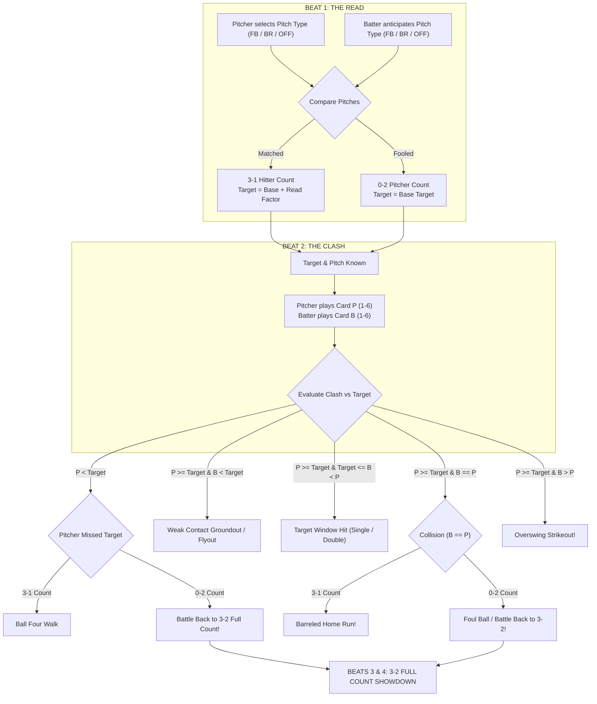

# Full Count — Game Design Document (GDD)
**Version:** 2.0 (Clean Architecture & Minimalist Design)  
**Author:** DeepMind Pair Programmer & Core Team  
**Design Principle:** *Zero Noise, Pure Deduction.*

---

## 1. Executive Summary & Game Identity

**Full Count** is a fast-paced, 2-player psychological baseball card duel. It recreates the quintessential moment in sports: the high-stakes chess match between a pitcher on the mound and a hitter in the batter's box.

### Core Pillars
1. **Deduction Over Math**: Outcome is primarily driven by anticipating the pitch type.
2. **Pure Number Cards**: No card text, no paragraph abilities, no status effect tokens. Hand cards are pure values (1–6).
3. **Pacing of a Plate Appearance**: Every PA unfolds in two crisp beats: **The Read** (establishing count leverage) followed by **The Clash** (pitch execution vs. swing).
4. **Minimalist Aesthetic**: If a pixel does not directly inform the player's tactical decision on what pitch or card to play, it is removed.

---

## 2. Core Game Loop & Match Structure

### Match Setup
- **Format**: 3-Inning Regulation Game.
- **Roles**:
  - Top of each inning: Guest bats, Host pitches.
  - Bottom of each inning: Host bats, Guest pitches.
- **Outs**: 3 outs per half-inning.
- **Roster**: 1 Starting Pitcher per team, batting lineup of hitters.

---

## 3. The Plate Appearance (PA) Mechanics

Every plate appearance is resolved in **Two Beats** (extending to Beats 3 & 4 only if a full-count showdown is forced):



---

### Beat 1: The Read (Setup & Leverage)
- **Pitcher Action**: Selects 1 of 3 pitch types:
  - 🔥 **Fastball** (Base Target 4)
  - 🌀 **Breaking** (Base Target 4)
  - ⏱️ **Offspeed** (Base Target 3)
- **Batter Action**: Anticipates 1 of 3 pitch types:
  - 🔥 **Fastball** (+Read Factor, e.g. +1)
  - 🌀 **Breaking** (+Read Factor, e.g. +2)
  - ⏱️ **Offspeed** (+Read Factor, e.g. +1)
- **Cards from Hand**: **Zero cards played**. Cards in hand are disabled / view-only.
- **Resolution**:
  - **Match** (`pitchType === guessPitch`):
    - **3-1 Hitter's Count** (Batter Advantage).
    - $\text{Effective Target} = \text{Base Target} + \text{Read Factor}$.
    - Pitcher faces a harder target to throw a strike in the zone!
  - **Fooled** (`pitchType !== guessPitch`):
    - **0-2 Pitcher's Count** (Pitcher Advantage).
    - $\text{Effective Target} = \text{Base Target}$.
    - Pitcher holds count leverage.

#### The Beat 1 Result Screen
- Shows **Two Pitch Tiles**: Pitch Thrown vs. Pitch Anticipated (with icons).
- Shows **Count & Advantage**: e.g., `3-1 HITTER'S COUNT • BATTER ADVANTAGE`.
- Shows **Established Target**: e.g., `TARGET 5 (Base 4 + Read 1)`.
- **NO number cards are displayed.**

---

### Beat 2: The Clash (Execution & Collision)
Both players know the established pitch and target number.
- Each player selects **1 Card from Hand** (Values 1–6) to clash.
- **Resolution Matrix**:

| Condition | Outcome | Narrative Result |
| :--- | :--- | :--- |
| **$P < \text{Target}$** (on 3-1 count) | **Ball Four (Walk)** | Pitcher missed target; batter takes 1st base. |
| **$P < \text{Target}$** (on 0-2 count) | **Battle Back (3-2)** | Ball in dirt; count runs full to 3-2 Showdown! |
| **$P \ge \text{Target}$** and **$B < \text{Target}$** | **Groundout / Flyout** | Strike in zone; batter underswings $\rightarrow$ 1 Out. |
| **$P \ge \text{Target}$** and $\text{Target} \le B < P$ | **Hit in Target Window** | Batter barrels inside target window:<br/>• $B \ge 5 \rightarrow$ **Double**<br/>• $B \le 4 \rightarrow$ **Single** |
| **$P \ge \text{Target}$** and $B == P$ (3-1 Count) | **Home Run** 💥 | Exact match collision with read advantage $\rightarrow$ No-doubter HR! |
| **$P \ge \text{Target}$** and $B == P$ (0-2 Count) | **Foul Ball (3-2)** ⚾ | Exact match collision with pitcher advantage $\rightarrow$ Fouled off, full count! |
| **$P \ge \text{Target}$** and $B > P$ | **Strikeout** ⚡ | Batter overswings the delivery $\rightarrow$ Punchout Strikeout (1 Out). |

---

### Beats 3 & 4: Full Count Showdown (Payoff Pitch)
Triggered **only** when a 0-2 count battles back or is fouled off:
1. **Beat 3: Payoff Read**:
   - Pitcher chooses pitch type; batter anticipates pitch type.
   - Result screen shows the two pitches, advantage, and established payoff target.
2. **Beat 4: Payoff Clash**:
   - Both players play 1 card against the established payoff target.
   - Resolves the at-bat with finality (Walk on miss, HR or Single on collision, Hit in window, Out on miss/overswing).

---

## 4. Hand Economy & Deck Rules
- **Hand Size**: 5 Cards.
- **Values**: Pure numbers from 1 to 6.
- **Turn Spend**: Exactly 1 card spent per clash beat.
- **Refill**: At the conclusion of every Plate Appearance, both players draw back up to 5 cards from their deck.

---

## 5. Minimal UI Specification

### Philosophy: The 3 Screen Zones
The entire UI is vertically organized into 3 clear, uncrowded zones:

```
+-------------------------------------------------------+
|  TOP HUD: Scoreboard (Score | Inning | Outs | Bases)   |
|           Opponent Status Pill (Ready / Choosing)     |
+-------------------------------------------------------+
|                                                       |
|  CENTER DUEL ARENA:                                   |
|                                                       |
|  [Beat 1 / Beat 3]:                                   |
|    Select Pitch / Anticipation:                       |
|    [ 🔥 Fastball (Tgt 4) ]                            |
|    [ 🌀 Breaking (Tgt 4) ]                            |
|    [ ⏱️ Offspeed (Tgt 3) ]                            |
|                                                       |
|  [Beat 2 / Beat 4]:                                   |
|    PITCH SHOWCASE: 🔥 FASTBALL • TARGET 5             |
|    YOUR CLASH SLOT: [ Card 4 ]                        |
|                                                       |
|  ACTION BUTTON: [ LOCK IN ]                           |
|                                                       |
+-------------------------------------------------------+
|  BOTTOM DOCK:                                         |
|    YOUR HAND: [ 1 ] [ 2 ] [ 4 ] [ 5 ] [ 6 ]           |
+-------------------------------------------------------+
```

### Prohibited Clutter (What We Never Show)
1. **No walls of text**: No paragraphs explaining what a fastball is or long tooltip body text.
2. **No redundant pills**: No status badges repeating what is already displayed on pitch tiles.
3. **No cards on pitch screens**: Pitch selection result modals show ONLY pitch tiles, advantage, and new target number.
4. **No nested color frames**: Clean dark stadium theme with high-contrast gold, neon-blue, and orange accents.
